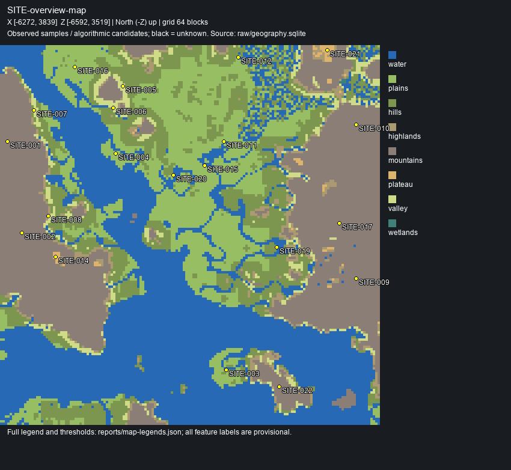

# Minecraft AI Build 成果

本仓库保存 Minecraft AI Build 任务的成果与复现材料。后续任务完成并验证后默认推送到这里。

## 自然地理初步探查 V1 · 建筑师

**状态：PARTIAL。结构化事实层完成，高级地貌仍需局部精查。**

- Minecraft 26.2 / DataVersion 4903，主世界。
- 完整生成范围：X=-6224～3807，Z=-6544～3487；393,129 个完整区块，单一连续矩形、无内部缺口。
- 64 格采样网格：24,964 个采样区块、124,820 根柱。
- 图谱：1,264 GEO / 412 HYD / 1,343 FEAT / 20 SITE。这些是算法分区与候选，不等于已确认的地貌数量。
- world writes = 0；全存档 1,524 个文件前后指纹一致。

[任务说明与查询方法](World-Survey/建筑师/README.md) · [短报告](World-Survey/建筑师/reports/summary.md) · [Survey Manifest](World-Survey/建筑师/manifest/survey.json) · [SQLite 无损归档](World-Survey/建筑师/raw/geography.sqlite.gz)



## 恢复数据库

数据库原始大小超过 GitHub 单文件限制，因此以 gzip 无损保存。`发布归档.json` 记录源数据库及压缩文件 SHA256，归档时已逐字节流式验证解压内容。

在仓库根目录执行：

```python
from pathlib import Path
import gzip, hashlib, json
p = Path('World-Survey/建筑师/raw')
record = json.loads(Path('发布归档.json').read_text(encoding='utf-8'))
data = gzip.decompress((p / 'geography.sqlite.gz').read_bytes())
assert hashlib.sha256(data).hexdigest() == record['database']['sha256']
target = p / 'geography.sqlite'
with target.open('xb') as f:
    f.write(data)
```

恢复文件被 Git 忽略。使用 Python SQLite 标准库即可查询；如需重新生成地图，安装 `requirements.txt` 中的依赖，然后执行任务目录中的 `scripts/Bootstrap/调查命令.py views`。原调查脚本使用 Windows Arial 字体；源存档不随仓库上传，`scan` 仍需明确传入本地实际存档路径。`manifest/toolchain.json` 记录原运行环境与脚本哈希。
