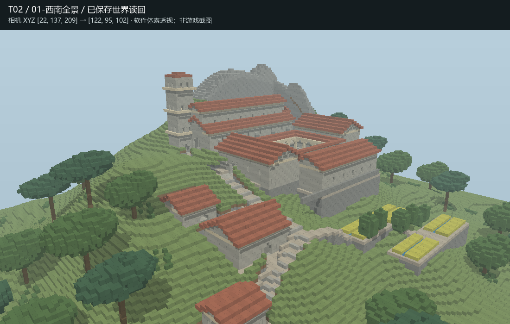
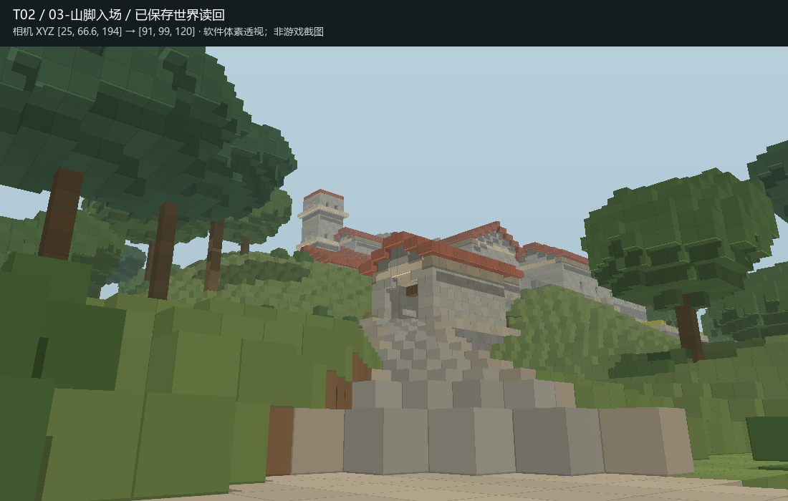
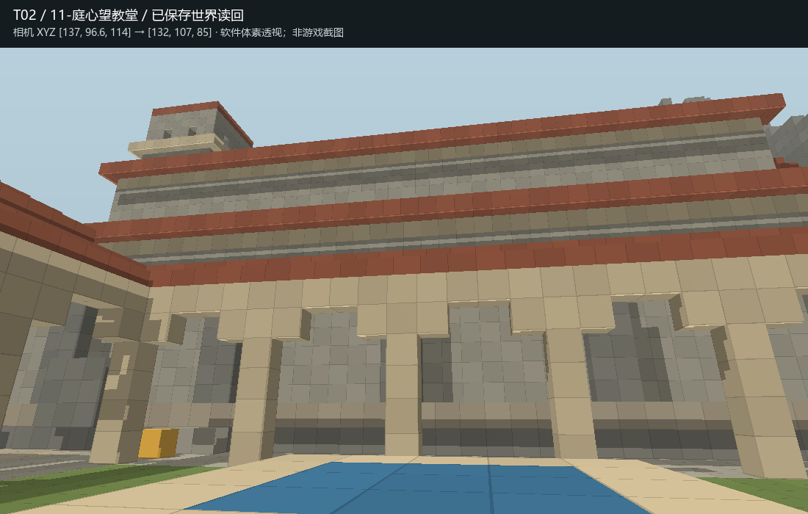

# MB-V11-T02 Completion Report

T02 已完成离线施工、阶段自检和有界修订，交付独立审核。本文不判断本轮回归测试最终 PASS / FAIL。

## 世界与 Skill

- 实际世界：`MB-V11-T02-山地修道院`。
- 存档：`D:/Games/Minecraft/.minecraft/versions/26.2-Fabric 0.19.5/saves/MB-V11-T02-山地修道院`。
- 全新世界，Minecraft 26.2，`NEW_WORLD_FACTORY`。保存后元数据确认 `minecraft:flat`、`generate_structures=0`、`structure_overrides=[]`；种子 `2026090902`。创造模式，和平难度。
- 实际读取：[minecraft-builder/SKILL.md](https://github.com/zhangchenjia21-dot/Vibe-Coding/blob/main/skill/codex/minecraft-builder/SKILL.md)，正文版本 **v1.1**。当前仓库内容通过 GitHub 获取，来源记录更新时间 `2026-09-09T07:36:59Z`；原文副本在 `来源/minecraft-builder-v1.1.md`，SHA256 `c258953d72a3bd8f39b07b5fee61baa5f3292d543a7d5d87e5f7c27979724a11`。没有修改 Skill。
- 未读取或使用 T01 评审、Owner feedback 或 findings；没有进入或施工 `建筑师` 存档。没有执行 T03。

## 现实研究与原创设计

主要依据是[加泰罗尼亚政府文化遗产：Monastery of Sant Pere de Rodes](https://patrimoni.gencat.cat/en/collection/monastery-sant-pere-de-rodes)。该资料明确说明其山地位置、11—14 世纪宗教中心地位、顺坡台地、教堂与回廊的组织关系，以及钟塔、日常生活空间和院长住所等组成。

补充阅读 [Sant Pere de Rodes](https://en.wikipedia.org/wiki/Sant_Pere_de_Rodes)，了解本笃会、朝圣、罗曼式教堂、侧廊、东端后殿与西侧钟塔。历史判断优先使用官方来源，维基仅作补充。网页快照与链接保存在 `来源/`；本轮未采用网上建筑蓝图。

成品为**参考上述空间逻辑的原创加泰罗尼亚山地修道院**，不是圣佩雷德罗德斯的测绘复原。设计范围 X0—239、Z0—219，基础草面 Y63。教堂约 49×19 格，钟塔 8×8 格，宗教核心连同生活翼约 68×68 格。

- **平面**：教堂置于高台，回廊位于其南侧，东厢、食堂和西厢围合生活核心。客舍、服务房、门楼和生产台地向下坡分布。回廊的规则秩序有宗教生活依据，外部路线随高差转折。
- **剖面**：山脚路面 Y64，门楼 Y76，客舍 Y82，服务房 Y86，食堂 Y90，回廊 Y94，教堂 Y96，钟塔屋顶至 Y129；北侧岩山构成更高背景。挡墙和基础承接各层台地。
- **游览序列**：山脚树冠间见钟塔 → 穿门楼 → 客舍旁转折上行 → 西侧登上教堂正门 → 内殿与侧廊 → 回廊及庭心 → 食堂、泉台和生产台地。主路与功能空间连接，主要目的地无需飞行。
- **环境**：坡脚与侧坡使用不同高度、冠幅的原创松树和阔叶树群，保留入口视线；高处裸岩、低处地被。泉台承担集水与用水，回廊有小水井，种植台地有灌溉沟。水源、植物组合和具体种植制度属于本设计解释，未声称是遗址考证事实。
- **资产选择**：先查询现有参考库与正式目录；现有云杉、橡树和教堂样本的尺度、地域语言不完全适合本轮，未机械拼用。树木与建筑均为任务原创，只保留任务候选。

## 实际施工与逐阶段自检

| 阶段 | 实际工作 | 自检与修订 |
|---|---|---|
| 1 | 山体、分层台地、结构性树群；860,016 个指定方块 | 核对全新目标、生成设置；蓝图与批次逐格一致；保存后读回，查看西南/东北透视、平面和剖面。确认实际高差、林冠与建筑承载空间。此时建筑尚未形成，阶段动线结果不作成品结论。 |
| 2 | 教堂、钟塔、回廊、生活翼、下院建筑和道路；21,853 个方块 | 实存透视、平面/剖面、13 个功能目的地连通性。检查体量主次和出入口；继续细查指定主路，发现“区域有路可达”不能代替原定路径连续。 |
| 3 | 水池、种植、地被、扶壁和细节；2,334 个方块 | 实存透视、连通性与主路逐段检查。发现主路局部撞墙；泉台原观察点位于水槽中，且槽边约束不足。 |
| 4 | 重铺主路、绕至教堂西门、修订泉槽与旁侧干平台、少量岩脚；4,202 个方块 | 检查玩家高度的入口、转折、内殿、回廊与泉台；发现西厢南端楼板有四格超出台地，局部缺基础。修正斜线采样的标高记录，使证据对应实际铺面。 |
| 5 | 补齐西厢南端承重基础；799 个方块 | 重读最终存档，重新生成全部视图；检查 8 栋建筑楼板下接触、主路净空、功能可达性与全范围逐格一致性。 |

每次写入均通过正式离线执行器正常加载、保存、关闭；已有测试世界施工前自动持锁备份。没有 raw region/POI/entity 写入。执行日志中的 `PASS` 只属于执行器状态，不代表空间质量或本轮回归结论。

最终保存体素与设计比较 **5,491,200 格，差异 0**；主路 **165 个中心采样点**无两格净空障碍，相邻标高差不超过一格。13 个主要目的地在允许一格台阶/跳步的离线模型中连通。8 栋建筑楼板下没有空气格。具体方法与数值见 `证据/最终逐格核验.json`、`最终基础接触.json` 和 `阶段5-动线.json`。

## 三维审计证据与坐标

下列图片均是**实际已保存世界读回的数据生成的软件体素透视，不是 Minecraft 客户端截图**。它们保留遮挡与透视，配合平面和正交剖面使用；不会以方块计数替代空间审阅。

`证据/` 还包含东北俯瞰、门楼前、上山转折、教堂入口、回廊西南、内殿、生产台地、泉台、平面、X=136 与 Z=108 两条剖面。阶段 1—4 的记录保留用于对照修订。相机坐标和朝向保存在 `观察点.json`。

| 位置 | 玩家脚部 XYZ |
|---|---|
| 出生/山脚入口 | 25, 65, 194 |
| 门楼通道 | 67, 77, 153 |
| 客舍 | 88, 83, 137 |
| 服务房 | 82, 87, 117 |
| 教堂内殿 | 130, 97, 81 |
| 西回廊 | 122, 95, 108 |
| 庭心井南北步道 | 136, 95, 105 |
| 东厢 / 西厢 | 160, 95, 107 / 113, 95, 108 |
| 食堂 | 127, 91, 129 |
| 上 / 下种植台地 | 130, 83, 151 / 142, 79, 165 |
| 泉台干平台 | 176, 95, 116 |

## 已知限制

- 未启动 Minecraft 客户端进行真人游览；步行检查为离线两格净空、支承面与一格高差模型，允许跳步，不等于游戏物理完整验证。钟塔梯子已建，但攀爬操作不在该步行模型内。
- 软件透视把楼梯、栅栏、灯、作物和树叶等按整格体素包络绘制，未模拟原版材质、透明度、精确碰撞形状或室内光照。因此楼梯在图中更粗重；审核者应结合完整 block states 与游戏内观察。
- 山体为有限测试范围内的原创塑形，外缘接回超平坦；北侧山峰轮廓、岩层、建筑表面与屋面仍有简化。泉台属于生活水工空间，朝西主要面对东厢墙，并非开阔观景台。
- 内部仅完成可进入的基本空间、拱廊和交通，未完整布置家具、礼仪陈设、宿舍细分或历史复原装饰。水槽与种植的长期游戏 tick 行为未作长期模拟。

## 推荐入库资产候选清单

| 临时名称 / ID | 类型与尺寸 X×Y×Z | spatial role / 用途 | 当前世界位置 | 推荐理由、类似资产与建议类别 |
|---|---|---|---|---|
| 坡地偏冠伞松 / T02-C01 | 自创结构性乔木，17×19×13 | 坡地林冠、入口框景、林缘组团 | 包围盒起点 48,91,93；主干约 57,91,99；任务预览 `候选/T02-C01.json` | 偏心双层冠幅与高干可用于地中海山坡林缘，尺度可衔接多层建筑。库内有云杉/橡树，但未确认有同用途伞松。建议类别：结构性植被 / 地中海乔木。 |

仅推荐 Owner 真人查看，未正式加入资产库。
