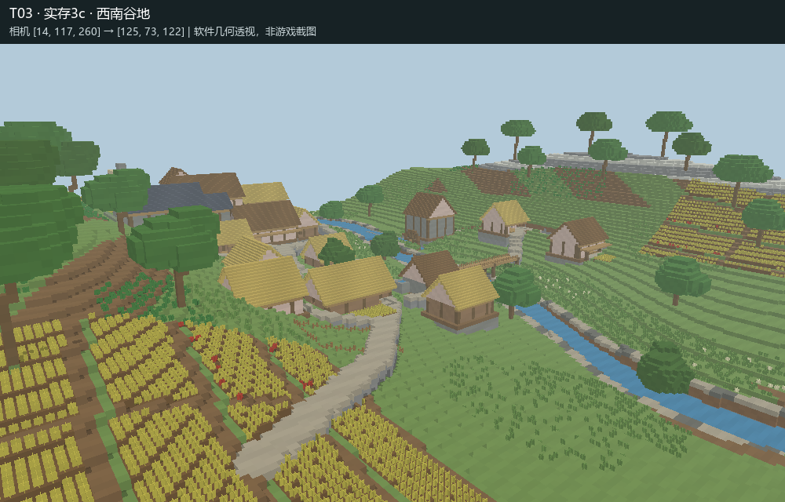
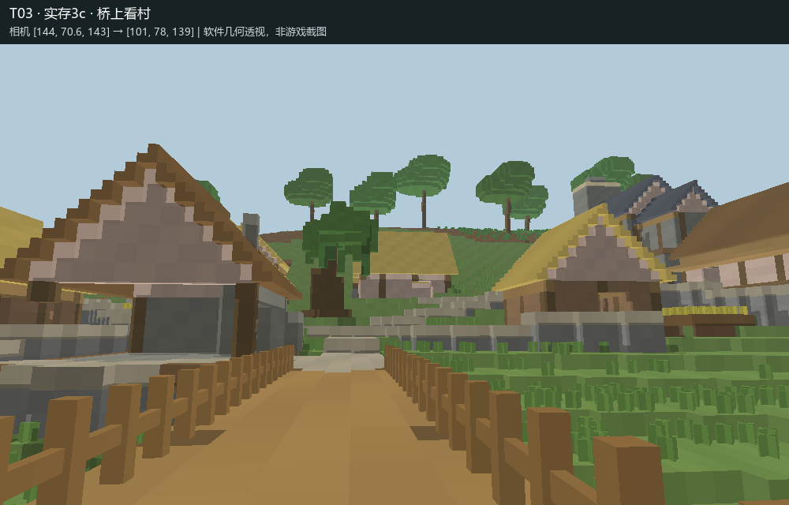
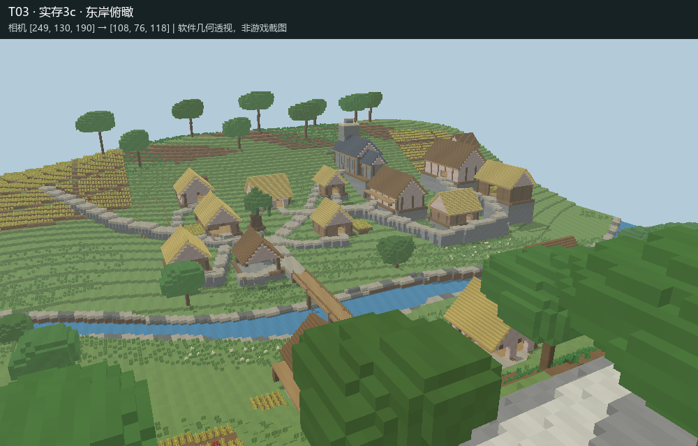

# T03 Completion Report

已完成本轮施工、保存关闭、实存读回与空间自检，提交独立审核；不作回归 PASS / FAIL 判定。

## 世界与 Skill

- 唯一测试世界：`MB-V12-T03-河谷村落`。
- 实际路径：`D:/Games/Minecraft/.minecraft/versions/26.2-Fabric 0.19.5/saves/MB-V12-T03-河谷村落`。
- 新建超平坦，种子 `2026091003`，`minecraft:flat`、`generate_structures=0`、`structure_overrides=[]`；每次写入前后核验身份。未进入或修改 `建筑师`。
- 实际读取 [minecraft-builder v1.2](https://github.com/zhangchenjia21-dot/Vibe-Coding/blob/main/skill/codex/minecraft-builder/SKILL.md)，原文快照见 [来源](来源/minecraft-builder-v1.2.md)。快照 SHA256：`06bea62b62d0e5246635639eb154411fd2ebf951761c071e96e75cd3231e51b5`。未修改 Skill，未读取 T01/T02 审核、反馈或结论。

## 现实研究与总体设计

1. [English Heritage：Wharram Percy 历史](https://www.english-heritage.org.uk/visit/places/wharram-percy-deserted-medieval-village/history/)：住宅、庄园、教堂、水磨和农业转型之间的关系。
2. [Victoria County History：Crowell](https://www.british-history.ac.uk/vch/oxon/vol8/pp80-91)：道路、水源、较高位置的教堂、条田、草甸、林地及生产服务。区分文中中世纪事实和后期描述。

原创14世纪英格兰河谷聚落，并非遗址测绘复原。设计范围 X/Z 0—255、Y56—135。河流沿谷底弯曲，上下游水位 Y65/Y62；十户住居依西岸河阶及东岸道路组织，配教堂、庄园、谷仓、铁匠、水磨、木桥、公共井、菜圃、条田、草甸及坡林。公共草地承担汇路与会面，低地留作可淹草甸，坡地安排生产与林冠背景。

游览顺序为南侧田路—村中草地—坡上住居与教堂—桥头—东岸水磨及农业。长屋、厅屋附低翼、低矮农舍、庄园上层、开敞谷仓和教堂有不同体量；石基、土墙/灰泥、木框架形成统一材料语言。竹楼梯表达茅草屋面，仅为游戏材料替代。

查询过参考库；仅复用 REF-0049 的树干与树冠片段一次，约在 `(86,71,144)`，移除原平基地块并处理叶状态，其余为本任务设计。未正式登记新资产。

## 实际施工、自检与修订

全部使用正式离线执行器加载、持锁、批写、保存、关闭；没有 LIVE/Bot/LAN 或 raw region 写入。

|阶段|实际内容|实存自检与修订|
|---|---|---|
|1|河谷、河阶、水系、结构树群；1,530,548 格|平面、两剖面和双向透视发现下游原草层盖水；1b 清除盖层并开尾水道，2,207 格。六邻域检查发现斜接树干未连续；1c 加 23 格接口，重型几何连通恢复。|
|2|住居、公共/生产设施、桥路；78,824 格|透视与路线检查发现北路碰宅、支路断口、上层平台/梯梁接口。2b 有界重建农舍 F、绕行北路、修磨坊平台和庄园梯梁，共 2,775 格；两处采样误落炉灶，移到真实通行位置后重查。|
|3|条田、林下地表、近地草蕨花、井与围界；24,867 格|检查发现井占路和固定标高石标悬空；3b 移井、石标落地，268 格。全量比对发现后期植被覆盖 19 格路基；3c 恢复这些地下接口。|
|最终|保存后重新读取全部观察体积|5,242,880 格逐状态比对差异为 0；登记目标全部可达、道路采样无阻挡；六邻域重型几何未发现孤立方块。检查平面、剖面、鸟瞰及玩家高度视点。|

施工前检查还拦截过阶段3陈旧未执行蓝图瓦片，以及3c修订蓝图包络超限；均在写入前纠正。全部实际执行记录保留于证据目录，不以方块写入计数代替空间质量判断。

## 空间证据与观察点

以下是**实际保存区块生成的软件几何透视，不是 Minecraft 客户端截图**。无生成式图像；原始体素导出、palette、坐标、SHA256 与观察脚本一并提供，可换用其它观察器独立审计。

完整证据另含村中、教堂门前、长屋、草甸、水轮、条田、北庄院等视点，共12张透视，加平面与2张剖面；精确相机见 [视点记录](证据/阶段3c-视点.json)。

|区域/目的|坐标 X,Y,Z|
|---|---|
|桥中脚点|144,69,143|
|村中相机|99,72.6,147|
|教堂内部脚点|58,83,90|
|长屋 A 内部脚点|74,73,156|
|庄园内部脚点|86,82,55|
|庄园上层脚点|77,88,43|
|磨坊上层脚点|170,73,89|
|水轮相机|156,67.6,99|
|公共井|105—108,70—71,147—150|

## 已知问题与验证边界

- 未进行 Minecraft 客户端实走、原生纹理/光照观察和长期游戏 tick 验证。可达性模型采用两格净空、一格上落或跳步，不能替代客户端碰撞物理；农田湿度、流体和植物后续更新尚待实际游览观察。
- 水轮为静态造型；内部仅基本交通与少量用途提示，没有完整生活家具或经济模拟。
- 软件观察器近似楼梯、半砖、栏杆、植物形状；不证明原生渲染观感。所有画面均明确标注。
- 坡地仍有明显方块等高台阶，部分主干与树冠造型偏简化；若干宅基和北庄台地外露石面较高。东岸 I 名义楼板包围盒下有11格空隙，整体已连通，但尚未用客户端逐格复核其边缘构造。
- 本轮造景为有限256格范围，外围仍接超平坦世界；不声称构建了完整区域流域。两处现实来源支持空间逻辑，不构成单一村落的精确历史复原。

### 推荐入库资产候选清单

本轮无推荐入库资产候选。

现有原创构筑物和树型保留为本任务成果；在上述视觉与客户端验证边界下，暂不推荐作为通用资产。REF-0049 属既有复用资产。未正式加入资产库，完成 T03 后停止，不执行 T04。
