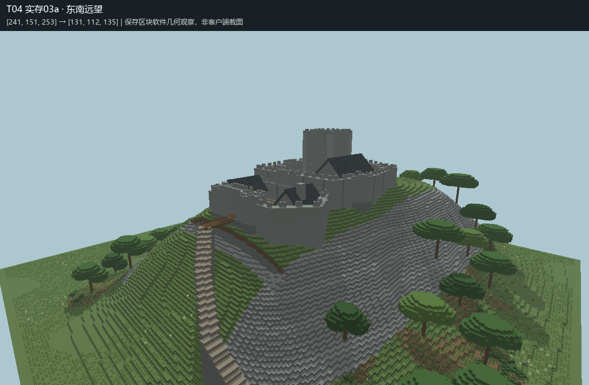
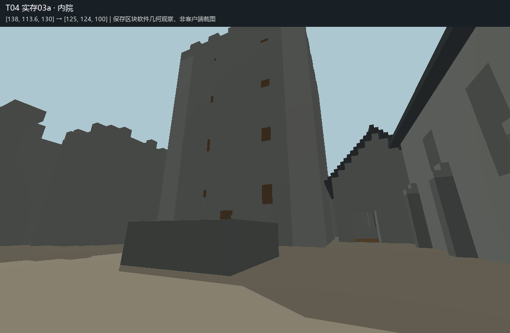
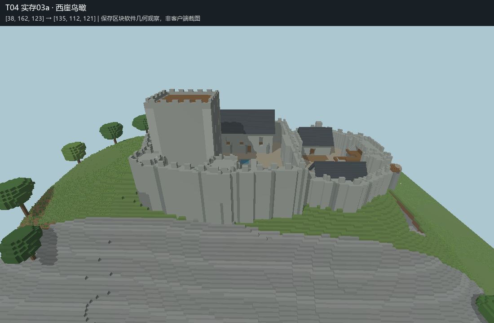

# T04 Completion Report

本轮施工、保存关闭及实存空间自检已完成，提交独立审核。未判定回归 PASS / FAIL，未执行 T05。

## 世界与 Skill

- 唯一世界：`MB-V13-T04-山脊城堡`，全新超平坦，结构生成关闭；种子 `2026091004`。实存核验 `minecraft:flat`、`generate_structures=0`、`structure_overrides=[]`。
- 实际存档：`D:/Games/Minecraft/.minecraft/versions/26.2-Fabric 0.19.5/saves/MB-V13-T04-山脊城堡`。每次施工前后核对目标；未进入或修改 `建筑师`。
- 实际读取 [当前仓库 minecraft-builder v1.3](https://github.com/zhangchenjia21-dot/Vibe-Coding/blob/main/skill/codex/minecraft-builder/SKILL.md)，来源修改时间 `2026-09-10T02:27:12Z`。原文快照见来源目录，SHA256：`f1f2ab88fd686f192ad5a21fe61f7aade940bd476b199e44f2e71943c7a29c8a`。未修改 Skill；未读取或使用 T01—T03 的审核、反馈及测试结论作为设计提示。

## 现实研究与设计

主要资料为 [Cadw：Harlech Castle](https://cadw.gov.wales/visit/places-to-visit/harlech-castle) 与 [English Heritage：Goodrich Castle 历史](https://www.english-heritage.org.uk/visit/places/goodrich-castle/history-and-stories/history/)。前者说明岩丘、天然防御、分层防线和补给路线的关系；后者说明交通节点、早期主塔、后期防御壳体及贵族家政建筑的关系。未把其海岸环境、后世废墟或现代游客设施机械移植。

成品是约13世纪末英威边区的原创山脊城堡，非遗址复原。256×256格的连续岩脊承托内外两院；西侧陡坡，南侧干壕与木桥控制接近。主塔、厅堂、礼拜堂、门楼、马厩、厨房和蓄水池组成防御及日常使用空间。低坡林群形成背景，近墙地带留作观察和通行；草坡、林下粗土、灌丛、蕨草及少量花形成不同覆盖。

道路从东南坡脚曲折上行，跨壕入外院，再经内门进入主院，继续登主塔和墙顶。内外院地面为Y111/Y108；其局部整平平均绝对填挖约1.94/2.07格，边缘最大填方9/7格。建筑依岩脊组织，未以一个独立矩形大底座承托全堡。

已查询 Reference 树类资产的尺度与用途；本轮采用任务原创阔叶树群，未复用或正式登记资产。

## 实际阶段与自检修订

采用正式离线执行器与 Canonical Blueprint，持锁、备份、批写、保存关闭，随后从已保存区块读回。没有 LIVE、Bot/LAN 或 raw region 写入。

|阶段|内容与检查|实际修订|
|---|---|---|
|施工前|研究、平面/剖面方案、设计透视、通行与六邻域检查|扩大内门开口至完整墙厚；把外墙楼梯放到院内可接近位置；补齐垛口支承。均在建筑写入前完成。|
|01|山脊、壕沟、桥路、结构林群；实际平面、两剖面及三方向透视；道路可达，重型几何无孤立|地形实存与模型一致；此时尚未建造的楼层/墙顶不作为可达目标。|
|02|城墙、塔楼、厅堂及服务建筑；实存比对、主要楼层与两院通行、透视|原登记目标可达；进一步检查门楼上层与院面表达。|
|02a|门楼上层楼梯/画廊/屋顶交通；院面改成连续砾石及服务区踩踏土|补平台净空与起步接口后施工；保存读回后目标均可达。|
|03|草坡、林下与近地植被、少量生活细节|对照02a实际区块：前序结构实体改动0；建筑包络只增加预期火把/草料，未清除外墙、屋顶或楼板。|
|03a|最终玩家高度图发现主塔封顶环带缺失|补164格屋顶环带，保留内部楼梯出口。重新保存、读回、检查及取景。|

终态 `03a`：8,388,608格逐方块完整状态比对差异0；23个登记目标全部可达；三条主路线采样无阻断；六邻域检查未发现孤立重型几何。上述为限定方法的工程证据，不等于空间质量或客户端体验的最终判定。

## 独立空间审计证据

证据为**实际保存区块的软件几何观察，不是 Minecraft 客户端截图**；没有生成式图像或用设计预览冒充实存。终态含12个透视视点、平面、两剖面、palette与压缩体素读回；可使用其它工具独立重建观察。

关键脚点如下；完整相机与朝向见 `证据/实存03a-视点.json`。

|区域|X,Y,Z|
|---|---|
|出生/坡脚接近|224,65,246|
|壕桥|135,109,191|
|外门通道|134,109,176|
|外门画廊 / 屋顶|134,117,175 / 138,121,177|
|内门|133,112,140|
|内院|137,112,128|
|厅堂|148,112,121|
|主塔入口 / 顶层|124,112,105 / 127,144,101|
|内墙 / 外墙步道|107,124,123 / 164,118,154|

## 已知问题与限制

- 未启动客户端实走，也未验证原生纹理、光照、长期植物/水体更新。通行检查采用两格净空及一格上落/跳步；接近道路部分需要跳步，不能声称已完成无跳跃通行或完整碰撞物理验证。
- 软件观察器近似楼梯、栏杆、植物等形状，不渲染原生贴图；阴影下的材料区别不充分，不能据此宣称游戏内材质效果已经确认。
- 岩坡存在明显等高台阶，部分石面和主塔侧墙较整齐；树冠组合仍有家族重复感。墙顶局部较窄，需玩家谨慎游览；未声称所有塔内空间都有完整家具和楼层。
- 主塔封顶缺口曾逃过整体连通检查，最终通过视图发现并修订；这说明自动计数只能辅助观察。
- 造景止于256格范围，外围仍为超平坦；不代表完整山系。蓄水池和防御构件为静态空间表达，没有供水、吊桥或战斗机制模拟。

### 推荐入库资产候选清单

本轮无推荐入库资产候选。

原创构件保留在本任务，尚不推荐作为通用资产；未进行正式提取或注册。
