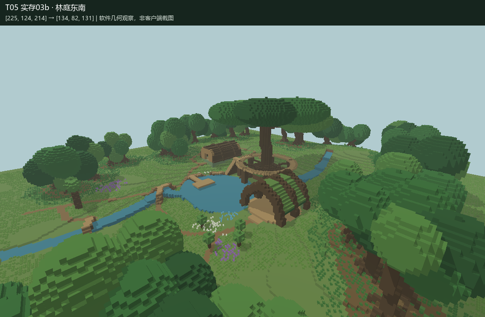

# T05 Completion Report：织根者的回声林庭

已完成本轮离线施工、保存关闭、实存读回与软件空间自检，供独立审核及 Owner 实机游览。本文不判定回归测试最终 PASS / FAIL；未执行 T06。

## 世界与 Skill

- 实际世界：**MB-V14-T05-森林圣所**。路径：`D:/Games/Minecraft/.minecraft/versions/26.2-Fabric 0.19.5/saves/MB-V14-T05-森林圣所`。
- 本轮新建，创造模式；主世界 `minecraft:flat`，seed `2026091005`；`generate_structures=0`、`structure_overrides=[]`。每次既有世界施工和读回核验名称、路径、生成器及结构开关。仅通过 AI-Offline 正常加载、持锁备份、批写、保存、关闭；未对 `建筑师` 施工，未使用 LIVE/MCP/Bot，未直接写 region/POI/entity。
- 实际完整读取并使用 [minecraft-builder v1.4 原文](来源/minecraft-builder-v1.4.md)，来源 [GitHub SKILL.md](https://github.com/zhangchenjia21-dot/Vibe-Coding/blob/main/skill/codex/minecraft-builder/SKILL.md)，取得的修改时间 `2026-09-10T09:31:51Z`。原样保留，未修改 Skill。快照 SHA256：`ee993e12943c6591b12906a00adce7a87ef8f4c7a141d04aa3a1ab272116e6be`。
- 类型：LANDSCAPE / MIXED_ENVIRONMENT。依据本任务、Skill、原创世界规则及测试世界；未读取或利用 T01—T04 的审阅、反馈或结论。本轮幻想题材不引用现实历史资料。

## 世界规则与总体设计

织根者以数十年共生园艺引导活根承重，不具备悬浮或瞬间生长能力，不砍开健康主干造房。枯倒木可加工，石材用于湿脚和耐磨踏步，少量有支承的菌光用于照明。祖树承载以水声、年轮和种子延续的集体记忆；圣所同时承担育苗、种子保存、巡林接待和仪式职责。详见 [施工前规则与设计](世界规则与设计.md)。

256×256 格场地由低丘、浅沟、泉池和林群构成，观察范围 Y56—151。祖树位于池北岸；根廊围绕主干，西侧干丘安置倒木种子室，东岸设置开放肋架叶棚议庭，南侧向光开口安排幼林圃。42 株结构树参与围合、遮挡与冠层；草蕨、苔地、腐殖土、灌丛及白紫蓝花群响应林下、湿岸和管理区。

游览从南缘根门进入，沿曲径跨沟到泉池开敞面，再上祖树根廊回望；支路连接种子室、议庭、幼林圃并闭合。地面路径随地形，局部填挖最大 5 格、样本平均约 0.35 格；根桥和环廊因跨水、绕树而架空。主体使用活木骨架，倒木壳与叶棚肋架承担不同功能，未直接复用参考资产。

## 实际施工、自检与修订

| 阶段 | 实际施工 | 自检与修订 |
|---|---|---|
| 01 Macro | 新世界、低丘泉池、祖树及结构林群；946,502 格 | 保存读回全观察体积，平面、双剖面和三个实存斜视；检查树地支承及水体分量。阶段尚无完整交通，未把此时未达建筑点当作最终结果。 |
| 01a 水系接口 | 399 格 | 补分段跌水、入池与出池短沟，恢复错误转向小水袋为土丘。读回差异 0、孤立重型几何 0，水系连为一个分量。 |
| 02 Meso | 路径、根桥环廊、种子室、议庭、入口；9,755 格 | 设计预检修正共享路面覆盖、种子室绕行、梯地接口、肋架屋盖相交和栏杆支承；实存检查全部目标及路线采样可达，查看入口、根廊、议庭与种子室等透视。发现桥脚隔离两格水袋，列入收尾。 |
| 03 Micro | 地被、草蕨花群、幼树、栏杆状态和菌光；36,985 格 | 施工前移开两株占路幼树。保存读回路线无阻塞、重型几何无孤岛。比较前后状态及建筑包络，识别 23 格草本误覆盖修订水土。 |
| 03a 岸脚收尾 | 两格孤立水袋回填湿岸土 | 保存读回、通行与水体分量检查。 |
| 03b 湿岸植被修订（最终） | 恢复误覆盖的 23 格水和湿岸土 | 初次预检因蓝图包围盒超过契约尺寸被拒，写入前改为实际局部包围盒。正式保存读回差异 0；10 个目标及全部路线采样可达，重型孤立几何 0；6,407 格水形成单个六邻接分量；草本支承检查未发现额外失托。最终透视、平面、双剖面及系统接口复查。 |

最终 [空间检查](证据/实存03b-检查.json)、[水系检查](证据/03b-水系连通.json)、[系统接口比较](证据/系统接口检查.json)、[世界身份](证据/世界身份.json)均来自已保存世界。各阶段读回覆盖 6,291,456 格，规范化方块状态后与对应阶段方案比较差异均为 0。执行器 JSON 内部 `status` 仅指施工执行检查，不是本轮回归结论。

包络复查：种子室的屋壳、开口、地板未被后序系统清除；包络新增为边缘草本及一处菌光。议庭两处活木在 `(158,73,133)`、`(178,73,151)` 被有意替换为嵌入菌光，其余主体保持。栏杆连接状态调整属于明确细节施工；桥脚占水属于支承设计，最终主水道仍连续。

## 独立空间审核证据

**图像是保存区块体素的软件几何透视，非 Minecraft 客户端截图。** 台阶、半砖、栅栏和植物采用近似几何与示意色；不表达原版纹理、真实光照或完整客户端碰撞。保留实际体素、palette、视点和渲染脚本供独立复核，不以写入成功代替三维证据。

- 总体与冠层：[北侧](证据/实存03b-林冠北侧.png)、[西侧](证据/实存03b-林庭西侧.png)、[平面](证据/实存03b-平面.png)。
- 玩家高度序列：[入林门](证据/实存03b-入林门.png)、[泉池初见](证据/实存03b-泉池初见.png)、[听水台](证据/实存03b-听水台.png)、[祖树根廊](证据/实存03b-祖树根廊.png)。
- 功能空间：[议庭入口](证据/实存03b-议庭入口.png)、[倒木种子室](证据/实存03b-倒木种子室.png)、[幼林圃](证据/实存03b-幼林圃.png)、[林下回望](证据/实存03b-林下回望.png)、[北泉岸](证据/实存03b-北泉岸.png)。
- 垂直关系：[x=137 剖面](证据/实存03b-剖面x.png)、[z=148 剖面](证据/实存03b-剖面z.png)。
- [精确摄影眼点、目标及视场角](证据/实存03b-视点.json)；最终完整体素为 `证据/03b.bin.gz`，其未压缩 SHA256 在 `证据/03b.json`。

| 关键位置 | 玩家脚点 XYZ |
|---|---|
| 南入口 | 92,65,214 |
| 听水台 | 122,68,151 |
| 西／东根廊 | 121,76,113 ／ 155,76,112 |
| 北／南根廊 | 137,76,94 ／ 137,76,130 |
| 倒木种子室 | 94,71,127 |
| 叶棚议庭 | 169,69,147 |
| 幼林圃 | 165,66,173 |

## 已知问题与验证边界

- 未进行客户端实机步行、长时间流体/植物更新及夜景验证；可达性算法使用两格净空并允许一格台阶或跳跃，不等于所有路线无需跳跃，也不覆盖客户端全部碰撞状态。
- 树冠仍偏圆团、轮廓有重复感，部分低丘仍能读出较长等高台阶；树干和种子室端面细部较简化。这些是保留给独立空间审核的实际视觉限制。
- 场景只完成 256 格范围；溪流南端和林地边界接回超平坦测试画布，没有扩建完整区域生态。种子保存通过空间与书架作示意，没有交互生产系统；内部仅保证基本进入与使用空间。
- 原创对象与本场地的根系、地面和水岸接口耦合，未正式提取为通用资产。

## 归档与恢复

归档到 `zhangchenjia21-dot/assets/minecraft/MB-V14-T05/`，保留原工作目录。只含本轮方案、Skill 快照、任务脚本、Canonical 蓝图、作业和观察证据，不含完整游戏存档、备份、凭据或 Mods。

`归档恢复.py verify` 核对 SHA256SUMS；`归档恢复.py restore <新输出目录>` 验证后无损解压 `.bin.gz` / `.npy.gz` 并复制其他文件，不写 Minecraft 世界。读回二进制为 uint8，XYZ 顺序，Z 最快；reshape 为 256×96×256，世界 y=数组 y+56。设计数组使用 `场景.json` palette，实际数组使用各阶段同名 JSON palette。

复核需 Python、NumPy、Pillow、Node.js；在恢复目录运行 `空间核验.py 03b`、`水系核验.py 03b`、`系统接口核验.py`、`观察林庭.py 03b`。渲染脚本默认 Windows 微软雅黑字体。施工脚本另外依赖本机 AI-Offline / AI-Preview / AI-Blueprints 的公开 L3 接口，归档不是独立 Minecraft 运行时。

重算设计的顺序为 `生成林庭.py` → `泉流接口修订.py` → `岸脚收尾.py` → `湿岸植被修订.py`；不要只重跑第一步便覆盖已修订的阶段数组。世界已存在，创建入口会拒绝覆盖；本轮交付后不应为了复核再次施工。

### 推荐入库资产候选清单

本轮无推荐入库资产候选。
