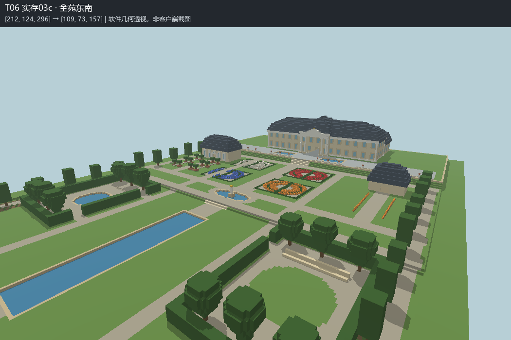

# T06 Completion Report：澄镜宫苑

完成本轮独立施工、保存关闭、实存读回及软件空间自检，供独立审核与 Owner 实机游览。未执行 T07，未修改 Skill，本文不裁定回归测试最终 PASS / FAIL。

## 实际世界与 Skill

- 世界：**MB-V15-T06-规则宫苑**。新建于 `D:/Games/Minecraft/.minecraft/versions/26.2-Fabric 0.19.5/saves/MB-V15-T06-规则宫苑`。主世界 `minecraft:flat`，seed `2026091106`，`generate_structures=0`、`structure_overrides=[]`；创造模式。
- 所有施工仅通过该精确路径的正式 AI-Offline 入口：新建拒绝覆盖既有目录，之后核验世界名称、生成器、结构开关及锁，持锁备份、批写、保存、关闭。未进入或修改 `建筑师` 施工，未使用 LIVE/MCP/Bot 或 raw region 写入。
- 完整读取并使用 [minecraft-builder v1.5 快照](来源/minecraft-builder-v1.5.md)，来源 [当前仓库 SKILL.md](https://github.com/zhangchenjia21-dot/Vibe-Coding/blob/main/skill/codex/minecraft-builder/SKILL.md)。取得的修改时间 `2026-09-10T10:57:34Z`；本轮快照 SHA256 `5aab7c11b4ee92420f6071a294622d7757977291b0a00cd63c0c2b6fe535b4e7`。
- 本轮依据任务、v1.5、必要历史研究和测试世界独立设计；未读取或利用 T01—T05 的审阅、反馈或结论。

## 研究与总体设计

主要来源为凡尔赛宫官方历史介绍：[The Gardens](https://en.chateauversailles.fr/discover/estate/gardens)、[Parterres and Paths](https://en.chateauversailles.fr/discover/estate/gardens/parterres-and-paths)、[The Groves](https://en.chateauversailles.fr/discover/estate/gardens/groves)。采用宫殿与园林同时构思、长轴透视、从平台俯看纹样、绿墙围合露天园室等事实；不复制凡尔赛尺度，也不混入后期英国式改造。原网页和提取正文保留在 `来源/`，详见 [研究与总体设计](研究与总体设计.md)。橘园专题网页请求超时，未把其未取得内容作为研究证据。

原创约 224×320 格的宫苑，偏 17 世纪末法国规则式语言。北侧前庭进入中央通厅，再到南侧观园平台；中央凸出亭、双层主楼与较低前庭翼部建立等级。浅暖墙面、深色折坡屋顶、窗套、墙脚和柱式对应各自构造。

地面 Y68／64／62 的低台地分别服务观园、花坛漫步及远端园室和镜渠，通过短阶与草坡过渡。四组花坛、两面平台镜池、圆池雕塑、远端镜渠组织长轴；西侧是水园与盆栽橘园式厅，东侧是绿剧场及园丁房。修剪树列和绿墙具有明确规则园艺职责。草坪用于衬托纹样与水面，花群集中于花坛和附属庭院，林下地表另行处理。

## 实际阶段、自检与修订

| 阶段 | 施工 | 实际检查与修订 |
|---|---|---|
| 01 Macro | 地形、衬砌池体、宫殿壳体、结构植被；683,068 格 | Canonical 与操作一致性、原生状态；保存读回全体积，三个斜视、平面、剖面、池底池岸与支承。设计预检加厚屋面交接、修正座阶支承。此时通厅和上层入口尚未施工。 |
| 02 Meso | 立面、入口、内部楼梯、附属屋和园室；16,943 格 | 实存 11 个目标可达、无孤立重型几何；检查前庭、通厅、上层及园室透视。近景发现主楼两侧墙面偏空。 |
| 02a 侧立面 | 两侧窗列和收边；534 格 | 保存读回差异 0、目标可达；将侧立面修订保留到后续阶段。 |
| 03 Micro | 花坛、盆栽、花带、林下地表、平台细部与圆池雕塑；7,306 格 | 施工前保留完整侧步道宽度；实存复查建筑与水体覆盖，六个主体包络未被细节破坏。透视发现橘园外窗框遮光，以及地面视点的花卉被一格高篱边遮挡。 |
| 03a 接口修订 | 橘园透光面、门框和圆池绕行铺地；150 格 | 读回、入口及池岸复查；橘园外表面变化属于明确修订（该阶段 38 格，门洞收尾后净变化 35 格），其余建筑包络保持。 |
| 03b 花层修订 | 1,384 格花坛篱边降为贴地修剪带，以苔藓薄层表达 | 同一地面视点复核花层可见性，保留园室高绿墙；最终全体积读回、目标通行、几何支承、水位和系统接口检查。 |

03c 门洞净空收尾：移除窗面修订误伸入橘园入口中央的 3 格玻璃，保留门楣上方采光窗；最终读回、净空及接口重新核验。

各阶段保存读回覆盖 **4,587,520 格**，规范化完整方块状态后与对应阶段方案差异均为 0。最终 11 个目标点可达、孤立重型几何 0、草本缺少土壤支承 0。上述是有限的技术与几何证据，不等于空间质量或实机验收结论。执行器原始 JSON 中 `status` 仅指执行器自身检查。

[最终空间检查](证据/实存03c-检查.json) · [系统接口比较](证据/系统接口复核.json) · [水景与植被检查](证据/水景与植被检查.json) · [世界身份](证据/世界身份.json)

## 水体 QA 与验证边界

| 检查维度 | 实际结果 |
|---|---|
| Geometry connectivity | 5 个设计为独立的池体，各自一个连通分量；最终共 2,072 格水。 |
| Water-level logic | 平台池水 Y67，轴线圆池 Y63，远端镜渠和西水园 Y61；没有跨级静态水带。 |
| Bank / bed containment | 所有水格侧面和底部有水或实体约束，未发现开放侧漏口或缺底；岸顶高于水面。圆池 9 格水由预定雕塑基座取代。 |
| Fluid-update stability | **fluid stability unverified**。已读正式执行器：WorldEdit 禁用侧效应，无对外水更新/等待接口。未扩建工具，也未用静态连通和截图代替 Vanilla 流体稳定性验证。 |

## 三维空间证据

**以下为已保存体素的软件几何透视，不是 Minecraft 客户端截图。** 示意色、玻璃不透明表示、楼梯及植物近似几何不能替代原版材质、光照与碰撞。保存原始体素、palette、相机及脚本，独立审核者可重建其它视角。

- 总体：[宫殿西南](证据/实存03c-宫殿西南.png)、[园室与镜渠](证据/实存03c-园室与镜渠.png)、[平面](证据/实存03c-平面.png)。
- 到达与长轴：[前庭到达](证据/实存03c-前庭到达.png)、[观园平台](证据/实存03c-观园平台.png)、[花坛回望](证据/实存03c-花坛回望.png)、[镜渠终端](证据/实存03c-镜渠终端.png)。
- 地面园室：[花坛步道](证据/实存03c-花坛步道.png)、[西水园](证据/实存03c-西水园.png)、[绿剧场](证据/实存03c-绿剧场.png)、[橘园花庭](证据/实存03c-橘园花庭.png)、[橘园入口近景](证据/实存03c-橘园入口近景.png)。
- 建筑交通：[通厅](证据/实存03c-宫殿通厅.png)、[上层](证据/实存03c-宫殿上层.png)。
- 垂直关系：[x=112 轴线剖面](证据/实存03c-剖面x.png)、[z=55 宫殿剖面](证据/实存03c-剖面z.png)。剖面未切到的支承应结合三维图判断。
- [14 个观察视点坐标](证据/实存03c-视点.json)，包括眼点、目标和视场角。最终体素 `证据/03c.bin.gz`，解压后 SHA256 见 `证据/03c.json`。早期图均保留阶段前缀，不能当作最终状态。

| 关键区域 | 玩家脚点 XYZ |
|---|---|
| 前庭／通厅 | 112,69,25 ／ 112,69,55 |
| 宫殿上层／观园平台 | 112,79,61 ／ 112,69,91 |
| 花坛主路／圆池西侧 | 112,65,145 ／ 95,65,185 |
| 西水园／东绿剧场 | 60,63,234 ／ 179,63,234 |
| 橘园厅／园丁房 | 44,65,122 ／ 184,65,122 |
| 镜渠终端 | 112,63,299 |

## 最终已知问题

- 未进行客户端实机步行、夜间光照或真实流体更新；通行检查允许一格台阶/跳跃，并采用近似碰撞，不证明全程无须跳跃。
- 立面雕饰、屋顶细部、盆栽、雕塑和园室座阶仍为较粗的 Minecraft 转译；贴地苔藓带表达低修剪纹样，并非真实黄杨物种。花种、季节和配色未作逐项历史复原。
- 宫殿内部仅完成基本楼层、通厅和楼梯，附属屋没有完整陈设或生产机制；水景采用静水蓄池，没有喷泉、暗管或泵站模拟。
- 设计范围外仍为超平坦画布；外部庄园、城市、完整林地及远景不在本轮成果内。

## 归档与复核

指定归档位置：`zhangchenjia21-dot/assets/minecraft/MB-V15-T06/`。保留原工作目录，不上传完整存档、备份、Mods 或凭据。

运行 `归档校验.py` 核对 SHA256SUMS。`.bin.gz` 和 `.npy.gz` 为无损 gzip，解压去掉末尾 `.gz` 即恢复原文件；蓝图自身的 `.json.gz` 保持压缩。实际 `.bin` 为 uint8、XYZ 顺序、Z 最快，reshape 为 `[224,64,320]`，世界 y=数组 y+56；使用同阶段 JSON palette，不能混用设计 palette。

复核需 Python/NumPy/Pillow、Node.js；恢复数组后运行 `空间检查.py 03c`、`接口复核.py`、`水景与植被复核.py` 和 `观察宫苑.py 03c`。绘图使用 Windows 微软雅黑字体。施工脚本还依赖本机 AI-Offline、AI-Preview、AI-Blueprints 公开 L3 接口，归档不是独立游戏运行时。

若只重算方案，顺序为 `生成宫苑.py` → `补齐侧立面.py` → `完成接口修订.py` → `降低纹样篱边.py` → `门洞净空收尾.py`。不要仅重跑生成器便覆盖后续修订数组。复核不需要再次写世界，创建入口会拒绝覆盖现有测试世界。

### 推荐入库资产候选清单

本轮无推荐入库资产候选。
