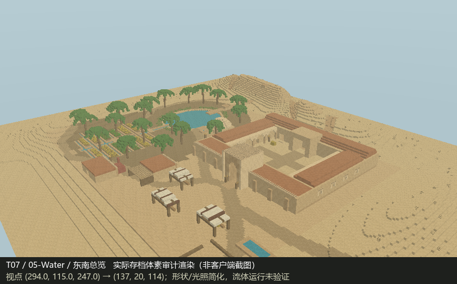
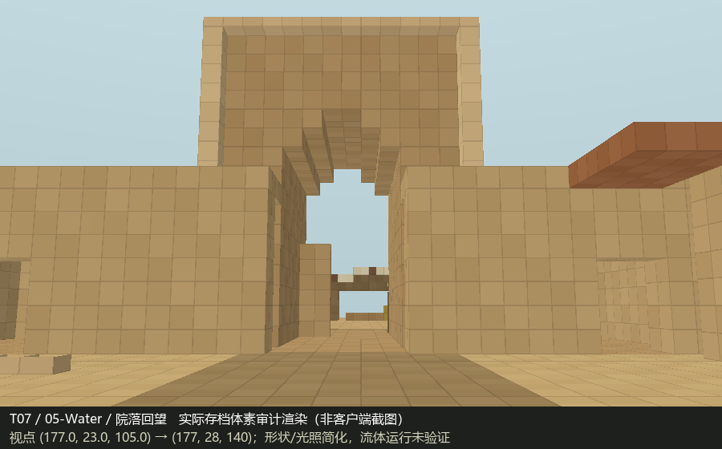
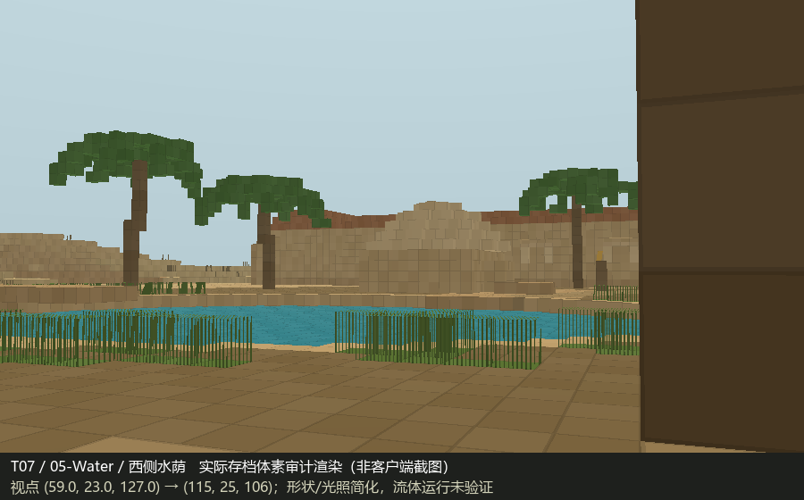

# T07 Completion Report

已完成世界施工、分阶段自检及局部返工，供 Owner 与独立审核者检查。**不作回归测试 PASS / FAIL 判定。**

## 世界与 Skill

- 实际世界：`MB-V15-T07-绿洲驿站`，位于 `D:/Games/Minecraft/.minecraft/versions/26.2-Fabric 0.19.5/saves/`。
- 本轮全新创建；26.2、沙漠生物群系超平坦、seed 1507、`generate_structures=0`、`structure_overrides=[]`。身份原始证据见 `证据/新世界身份.json`。
- 所有施工固定上述路径，并在每次写入前核验名称、生成器与世界锁。经正式 AI-Offline 工厂加载、批写、保存、关闭；未进入或修改 `建筑师`。
- 实际完整读取 [minecraft-builder v1.5](https://github.com/zhangchenjia21-dot/Vibe-Coding/blob/7934fbfdea46ba9d6cc53c8c244484bcf2ae1fe5/skill/codex/minecraft-builder/SKILL.md)，已核对该提交文本与首次读取文本一致。保留原文，不修改 Skill。
- 原文快照 SHA256：`5aab7c11b4ee92420f6071a294622d7757977291b0a00cd63c0c2b6fe535b4e7`。本轮没有读取或利用 T01—T06 的评审、反馈、findings 或结论。

## 研究与设计

主要资料为 [Caravanserai](https://en.wikipedia.org/wiki/Caravanserai) 的功能与萨法维建筑章节、[Qanat](https://en.wikipedia.org/wiki/Qanat) 的选址与聚落水系章节、[FAO 椰枣栽培第二章](https://www.fao.org/4/y4360e/y4360e06.htm)，辅以 [Tabas 地理资料](https://en.wikipedia.org/wiki/Tabas)。本轮实际读取的事实、来源层级和未能访问的页面均在 `研究与设计.md` 说明；没有把未读原著或被拦截网页列为已核验来源。

原创 17 世纪伊朗东部绿洲商旅节点，非具体古迹复原。288 × 240 格场地以“荒漠来路—补给交易—安全休息—绿洲生产”组织：北侧岩脊与地下引水末段，西侧取水池、储水屋、20 株棕榈与灌溉畦田，东侧约 76 × 68 格围合驿站，南侧市集、维修工院、烤炉仓房与驮畜饮水围场。

驿站包含厚门楼、院落、内向拱廊、客房、北侧厩棚及院侧屋面楼梯。砂岩表达土石砌体，整齐切石用于基础、转角和开口，陶土表达覆顶，木杆布棚用于轻型交易空间。低花量对应干旱环境，植被集中于可灌溉范围。

## 实际阶段与自检

| 阶段 | 实际施工 | 自检与修订 |
|---|---|---|
| 创建 | 沙质超平坦世界 | 核对名称、版本、生成设置、关闭后锁状态 |
| 01 Macro | 地形、水系、结构棕榈、驿站体量 | 磁盘读回、双向斜视与水荫/北脊视点；发现引水口和支渠被岸壁截断、北脊等高层过连续 |
| 02 Meso | 拱廊、分间、厩棚、屋顶、道路、市场、农业 | 接通水系、刻蚀支沟；屋面梯改到院侧；窄支渠补灌溉。核对主门至各关键空间净空和可达性，并看门前/院内透视 |
| 03 Micro | 墙脚窗框、雨口、铺地、草本、货物与照明 | 水体无侧空/底空；12 个观察位置可达；完整性扫描发现树体及棚布角接触断片 |
| 04 Repair | 羽叶/倾斜树干接缝、棚布承托、栏杆连接 | 孤立构件归零；接口复查发现补树根盘截住两格暗渠 |
| 05 Water | 仅恢复两格根盘下暗渠 | 水系恢复、根盘保留；重复水体、通行、完整性与建筑外壳检查 |
| 保存重载 | 无施工正常加载、保存关闭 | 3,594,240 格重载前后零差异；未把该检查当成受控 fluid tick |

最终静态检查：12 个关键位置均可达；六邻接实体孤立构件 0；水侧邻空气 0、底部空气缺口 0。主灌溉网络 4,401 水格；储水屋、人工补水取水点与牲畜槽为独立水体。全域实存与最终 Canonical Blueprint 的 3,594,240 格对照零差异，四组建筑外壳对照零差异。以上是完整性与几何证据，空间判断还结合下列透视，不能单凭这些数字认定空间质量。

## 独立空间审计证据

`证据/05-Water-*.png` 为**保存关闭后，从实际存档读取的体素透视渲染，不是 Minecraft 客户端截图，也不是概念效果图**。附双向鸟瞰、南来道路、门前、院落回望、水荫、田间、北脊视角，以及俯视和 Z=108 剖面。`证据索引.html` 可连续浏览。

压缩包保留每阶段实存三维数组、原生方块状态、哈希与生成脚本，可以换视点或逐格复核。原始世界和备份未上传。

| 位置 | 坐标 X / Y / Z |
|---|---|
| 南来道路落脚 | 231 / 20 / 202 |
| 主门内 | 177 / 21 / 139 |
| 院心 | 177 / 21 / 108 |
| 北厩棚 | 158 / 21 / 80 |
| 西/东客房 | 145 / 21 / 105；207 / 21 / 115 |
| 取水台 | 118 / 21 / 118 |
| 市集 / 工院 | 162 / 21 / 166；143 / 21 / 176 |
| 田间桥 / 屋面 | 90 / 21 / 168；166 / 29 / 134 |
| 鸟瞰观察点 | 294 / 115 / 247；18 / 95 / 18 |

## 已知问题与证据限制

- **fluid stability unverified**：没有受控 Vanilla 流体更新验证；当前只有床岸、水位与连接检查。现实坎儿井仅表达末段，非地下含水层模拟；取水点和畜槽以人工搬水补给解释。
- 未取得客户端实走、实机截图与夜间检查；通行检查使用两格净空、单格高差的体素近似。渲染简化楼梯、栅栏、草本、材质与光照，不能代替游戏中的精细外观和碰撞验收。
- 北脊虽已增加冲蚀沟，部分坡面仍有明显方块层级；外围在场地边界回到超平坦沙漠，未制作无限延展地貌。
- 内部为基本可进入空间，未完整布置旅店生活设施；没有模拟商人、驮畜实体、经济活动、真实水权或持续生产系统。
- 执行日志出现 Windows `Perflib 009` 性能计数器读取错误；本轮作业均继续完成保存关闭与全域读回，未修改系统计数器配置。不能将运行日志描述为完全无错误。

本轮施工结束，不继续创建其它测试。

### 推荐入库资产候选清单

以下仅为候选，未提取注册至正式库；真人批准后才可另开正式入库任务。

| 临时名称 | 类型 / 尺寸 | spatial role / 用途 | 当前世界位置 | 推荐理由 / 建议类别 |
|---|---|---|---|---|
| T07 羽状椰枣树 B | 原创结构乔木；约 13 × 15 × 15 格树体包络，不含地表 | 灌溉绿洲树荫、冠层边界和方向标 | 根部 68 / 20 / 82 | 羽叶及倾干接缝已修正；可作为干旱区种植变体。建议「植被 / 椰枣 / 结构乔木」；现库未检得合适对应资产 |
| T07 木脊布棚 A | 原创轻型构筑；11 × 7 × 7 格 | 路边交易、短暂停留与遮荫 | 包络 156 / 21 / 162 至 166 / 27 / 168 | 有柱、梁及折高棚布承托，可适应不同市集组合。建议「服务设施 / 市集荫棚」；参考库有白色沙漠小帐篷，但非本构型 |
