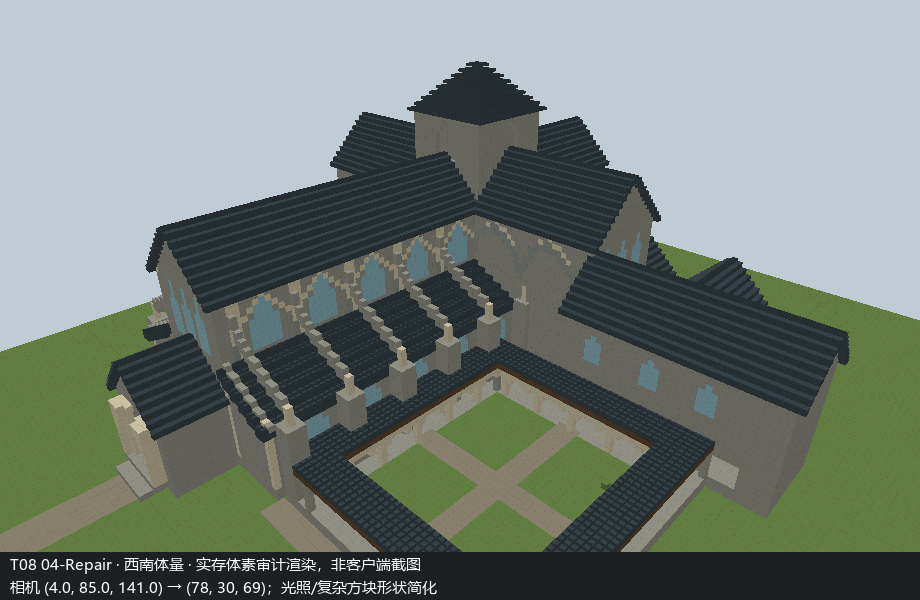
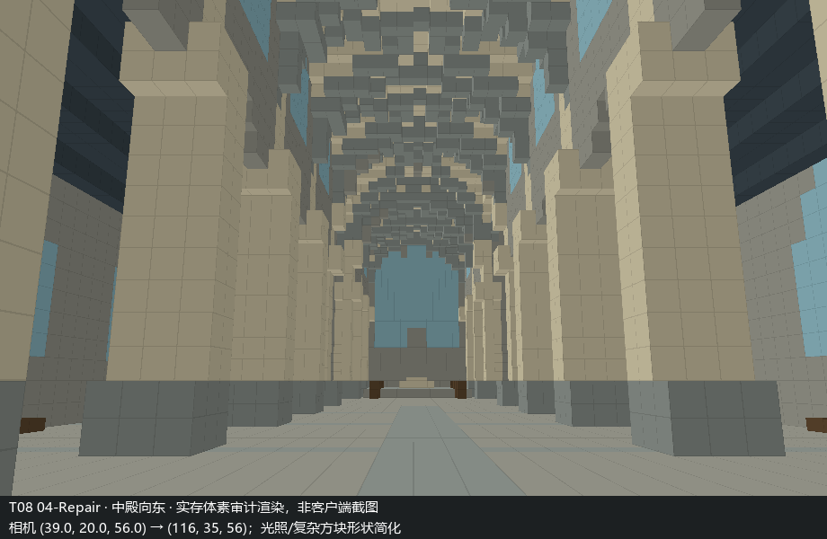
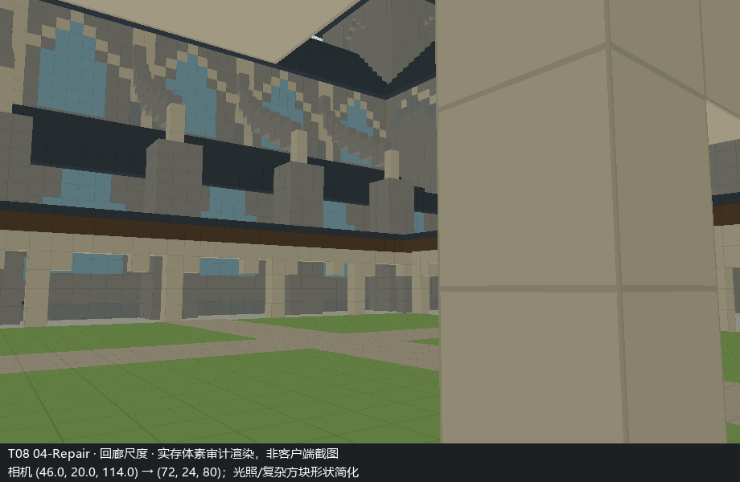
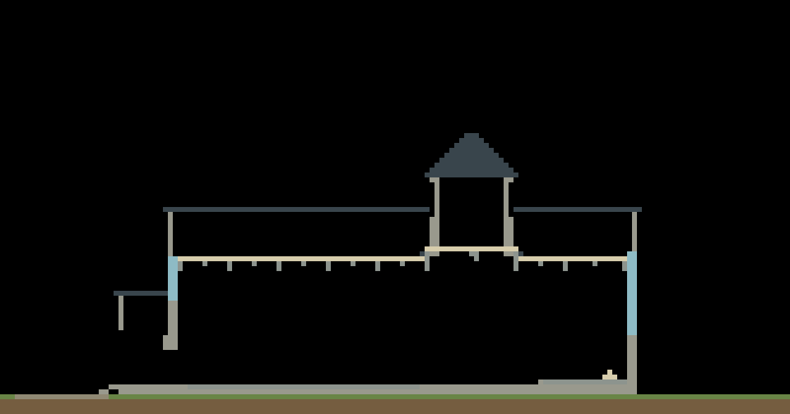

# MB-V16-T08 哥特教堂

[Completion Report](Completion%20Report.md) · [研究与设计](研究与设计.md) · [Massing Gate](证据/Massing%20Gate.md)

完成建造及模型自检，等待独立审核；不附回归 PASS / FAIL 判断。下图来自实际保存数据的简化体素渲染，不是客户端截图。

## 复核与恢复

`SHA256.json` 列出本目录交付文件哈希（不包含自身）。先核对压缩包哈希，再解压 `蓝图与实存证据.zip` 到本目录，恢复相对路径。压缩包不包含完整游戏存档。

`.u16` 是小端 UInt16，数组形状 `[84,144,160]` 按 Y/Z/X 排列，世界起点 `[0,12,0]`；其调色板及哈希见同名 `-实存.json`。最终数据为 `04-Repair.u16`，重载数据为 `reload.u16`，二者 SHA256 相同。

安装 Python、NumPy、Pillow，在 Windows 下运行 `python 建筑视图.py 04-Repair` 可重新生成审计图；字体默认 `C:/Windows/Fonts/msyh.ttc`。`python 建筑核验.py reload` 重新运行静态动线、实体连通与方案对比。渲染器不模拟真实光照，楼梯形状简化，详见报告限制。

`蓝图/` 保留四个增量阶段的 Canonical Blueprint；依次为 Macro、Meso、Micro、Repair。世界执行脚本依赖本机 AI-Offline 工程公开接口，且硬编码 T08 身份、拒绝重复创建；不是可对任意现存存档直接运行的安装包。不要使用 raw region 写入恢复建筑。

实际世界保留在本机；需要重建时使用同版本 NEW_WORLD_FACTORY 和正式执行器，在独立测试环境重新执行阶段蓝图。不得覆盖当前成果或用于真实存档。
