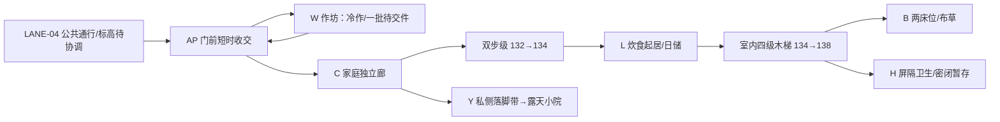

# MP-I01R｜BDP-01 低肩修理户 Architecture Design

设计 revision：r1。状态：**CONCEPT_DESIGN_WITH_INTERFACE_HOLD / 建筑概念方案已形成，未冻结，待 GPT + Owner 审核**。

`world writes = 0`。没有打开 Minecraft 存档、启动 Minecraft runtime、施工、冻结设计或裁定集成回归 PASS / FAIL。模型是本次从 BDP-01 开始创作的设计证据，不是既有北岩台建筑答案。

## 1. Architectural Intent

**目的。** 西来货物在转为轻载之前，就近完成手提小件收交和冷作修理。住户兼有日常值守作用，但房屋不是仓库、关卡或大型锻造厂；修理工作与一家人的完整生活必须同时成立。

**使用者。** 设计容纳一户家庭、一位进行小修理的操作者和短时收交者。两个床位是本轮用于检验尺度的设计假设，不是已证实的户籍、家庭人口或新增户数。若实际家庭规模更大，需要在冻结前重新验证睡眠与储藏，不以“一户”自动等于“两人”。不把包内邻接背景中提及的另一户及短宿要求转移成 BDP-01 的建设任务。

**场地。** R2-P1 的 151 个显式 column cells 是唯一落格依据。地表为 Y129–133 的岩肩，地面行走顶面为 ground_y+1。本户从低肩家庭院 Y131、作坊 Y132 上升到住屋 Y134；没有把整个前沿整平。建筑在拟议公共 LANE-04 的北侧，门外路和共同院不计入户用容量。

**形态。** 较低的单坡石作坊迎向收交，较高的双坡石基木上层住屋承载家庭生活。高度差来自地形和功能叠置；不做塔楼、不发明共墙或后巷。西来是运输方向，并不使本建筑自动归入西域。采用 CIV-001 共同石木构造，并以东域贴山、较厚石基与中域紧凑混用关系组织空间。

**时间。** 方案解释为 EARLY_GROWTH 条件下：先有低肩修理与收交位置，再以高肩双层住屋容纳稳定家庭日常。此为可建造的演化解释，不是已发生历史，不用随机破损伪造年代。

## 2. Plan / Program / Space Graph

所有以下 X/Z 范围为**包含端点的 block index**；Y 为行走表面。主屋外包络 X760–767 / Z1624–1629，作坊 X754–759 / Z1626–1631。主屋和作坊各以自身墙体承担荷载，连接只开局部门洞，不假设另一户承重或土地权利。

| 空间 | 位置与标高 | 实际功能和净尺度 |
|---|---|---|
| 门前缓冲 AP | 原 BDP 24 cells 原位保留 | 只供短时收交与停步；不封闭、不长期堆物。具体到达点候选为 (757,1633)，表面 Y132 |
| 作坊 W | 净 X755–756 / Z1627–1630，Y132 | 净室 2×4=8；北端两格修理台，一格批件架；剩余 5 格地面。适用手提小件、单人冷作，不接受大料或驮畜 |
| 家庭廊 C | X758 / Z1627–1630，Y132 | 连续 1 格净宽；X757 木隔断将修理活动挡在西侧。入口 (758,1631) 与工作入口 (755,1631) 分开 |
| 炊食起居 L | 净 X761–766 / Z1625–1628，Y134 | 6×4=24；四格楼梯、五格炊食/日储/桌占位，余 15 格地面用于通行与日常。不是把楼梯算成客厅净面积 |
| 上层楼面 | 同主屋净平面，Y138 | 24 格内扣四格楼梯洞口，实际楼面 20 格；洞口护栏细部有独立占位，不占一格楼梯宽 |
| 睡眠 B | X761–763 / Z1627–1628，Y138 | 两个 1×2 床位与中间 1 格侧向通道；北侧独立布草柜。不是完整独立卧室，床区采用轻屏隔的家庭开敞睡眠形式 |
| 卫生 H | X765–766 / Z1627–1628，Y138 | 2×2=4；两个后排洗涤/密闭便桶占位，前排 2 格可操作。无地下排污或未给出的污水终端 |
| 家庭院 Y | X751–753 / Z1627–1632，Y131 | 连通 3×6=18 格露天；从家庭门经本户南侧落脚带到达，不经作坊、不经另一户土地 |

小院由原 6×3 移为 3×6，符合 BDP 的等面积、连通、短边至少 2 格要求。原 apron 完全保留；新增南侧私侧落脚带位于本户 mask 内，连接两门与小院。小院没有上层悬挑、屋面或储物侵占。

W 与 C 之间不设穿行门；家庭不会把绕过工具和工件当作唯一通路。服务流复用合法入口但错时：先洁净水/日需进入，完成清理后才带出封闭污物。错时是一项待运营方确认的责任安排，不是已有运营事实。

## 3. Section / Structure / Tectonics

横剖 A–A（Z1628.5）显示院 Y131、作坊 Y132、两格阶梯与起居 Y134；B–B（Z1625.5）显示室内四级木梯与二层楼板洞口。

| 构造 | 设计值与因果 |
|---|---|
| 主屋基础 | 地表高肩上短石基，地坪方块 Y133 / 顶面134；主要为抬高一格，东端与地表 Y133 接触。不设地下室 |
| 作坊基础 | 地坪方块 Y131 / 顶面132；针对 Y130/131 的地表局部找平；不是全区统一平台 |
| 墙厚 | 主屋与作坊石墙各 1 格；在媒介中强调石基承重与门洞深度。连接穿过 X759、760 两格厚界面 |
| 分层 | 住屋首层净高 3（134 至楼板底137）；二层 Y138 至梁下140 为至少 2，梁间至屋面更高。楼梯顶部避开三条屋架拉梁 |
| 屋架 | 主屋横向木拉梁位于 X760、764、767，跨 Z1624–1629，约 4 格内跨；木柱落在石基和边墙上，硬屋面载荷传至拉梁/墙体 |
| 主屋屋顶 | 双坡、脊沿 X 向，北南收水；檐阶从 Y141 上升至脊顶144。两端墙补三角封闭，不向公共面伸檐 |
| 作坊屋顶 | 西低东高单坡，顶面约136.5–139；靠住屋收头，北南端补墙，短跨承于石墙。雨水收边和靠墙泛水待具体构件深化 |
| 室内楼梯 | X762–765 / Z1625，四个整格 stair 单元，每单元两个半格踏面；从134到138；底部 (761,1625)，上落脚 (766,1625) |
| 门前两步 | X759 / Y132 与 X760 / Y133，两级向东石 stair；门洞连续清空至Y137，避免上沿卡头 |
| 家庭院落脚 | X754 / Z1632，向东石 stair，将院131与门内132相接，全部在本户内 |

模型没有提出低于已观测 ground_y 的编辑。但地坪方块会替换部分最高地面方块，不能称“完全不改地表”。这仅降低切挖范围，不构成岩体承载、基础稳定或深部既有内容兼容的工程认证。浅层证据是 -24..+4 的局部快照，不能证明更深处为空或可施工。

## 4. Sequence / Facade / Environmental Design

**远景。** 沿西来路径看见低作坊先接住收交，再出现较高家庭住屋；其高低关系由岩肩和双层程序产生。无新地标塔，无公共院私有围合。

**中景。** 工作入口与家庭入口并列但功能不同：低墙小窗对应修理，木上层小窗对应睡眠。石与木的界线随楼层和承重转换，而不是随机混材。外窗分别对应工作台、炊食/起居、上层寝居与卫生；不依赖场外新开观景平台。

**近景。** 来客停在自家 apron，交件后原路离开。家庭进入东侧窄廊，在两级上升后看到较宽起居空间；再转入北侧楼梯，上层落脚避开床与便桶。回到院落时先退回独立廊，再沿私侧落脚下降进入 3 格宽露天院。压缩与释放来自窄廊、剖面与私密度，不靠装饰提示。

**环境。** 自然光由小窗与门洞进入；不声称已完成日照/夜间照明计算。家庭炊火在东侧石墙旁，烟道随墙上升至屋脊以上；当前为烟道实体占位，炉膛、排烟净腔、防火间距尚待细部验证。卫生为可封闭容器暂存，不设置地下渗坑。两只干式雨水容器在 (756,1625)、(757,1625) 表达本户收集预留，不能当作暴雨容量证明。

主屋屋面、作坊屋面与靠墙泛水需要本户可维护的收边，将来再接已批准的公共受纳接口。当前没有越界出水管、流动水方块或排向公共路面的默认出口。暴雨来量、有限调蓄量与安全溢流尚未闭合，**建筑不得据此冻结为可长期使用的水密成品**。

## 5. Minecraft Translation

交付 `设计体素.json`（552 个带角色/形状的设计体素）与 `设计几何.json`（可渲染/核验的形状盒），作为本轮允许的等价 voxel design artifact。它们不是 AI-Offline 可执行 Canonical Blueprint，不含 run-job 或世界写入命令。

| 设计材料 / 形状 | Minecraft 方案 | 保留的关系 / 当前边界 |
|---|---|---|
| stone | stone / stone_bricks；局部 stone_brick_stairs | 地表为岩石，石基与墙承担结构；采购与加工能力仍须运营闭合 |
| wood | spruce_log / spruce_planks / spruce_stairs | 木用于上层、楼板与短跨屋架；树种为拟用材，不宣称本地已有云杉供应 |
| plaster | 克制的浅色填充，可用 calcite 等作视觉代理 | 表示填充而非真实矿物供应结论；批准 palette 前保留为材料角色 |
| roof | deepslate_tile_stairs / slabs 作为硬质瓦板视觉代理 | 主屋向南/北、步级向东；需要完整 facing / half / shape / waterlogged 状态后才可编译 |
| screen / rail | 木屏与洞口护栏的细长碰撞包络 | 需选原生 trapdoor/fence 等并重新核验碰撞；当前自定义盒不冒充原生方块模型 |
| glass / bed / vessel | 小窗、1×2床、封闭容器占位 | 床头方向与两半状态、容器交互、窗体光照均未运行时认证 |
| 门 | 当前为三格高敞口 | 正式木门需 inward/recessed door leaf 设计与完整状态；本轮不以不存在的门扇声称隐私、防雨或防御完成 |

1 格家庭廊与门洞按 0.6×1.8 玩家身体作静态设计尺度；公共路仍必须由公共方证明连续 2 格净宽、3 格净高。524 个路径采样只检验当前设计模型的抬高踏步头部包络，没有运行 Minecraft 的跳跃、碰撞、门、流体或夜间行为。

## 6. Architectural Review Notes / Remaining Work

- 概念图证明了一个有限冷作工位、完整两床位家庭生活程序和独立院落动线可以放入当前包络；家庭实际人数、无门状态下的隐私、烟道、收水与构件细部仍待闭合，不能以面积表替代居住验收。
- 当前方案保留 Builder 作者权：房间、双层组织、楼梯、石基、单坡/双坡和院落移位均由本轮生成；没有把 Planner 的搜索区当作预设建筑轮廓。
- 当前没有发现模型构件越出显式 mask；公共扫掠净宽及接触标高仍为外部接口 HOLD。院落与路带 mask 非重叠并不等于公共道路已通过行走测试。
- 屋面接缝、薄屏与护栏、门扇、烟道和水量细化仍是 Builder 内部未闭合项。本轮提交可审核概念方案，不进入 CORE_BUILDING / SPATIAL_COMPLETE / FINISHED / VERIFIED。

详细依赖责任、最小上游补充及冻结条件见 `issues.json` 与 `handoff-consumption-record.md`。完成本轮归档后停止，交 GPT + Owner 审核。
