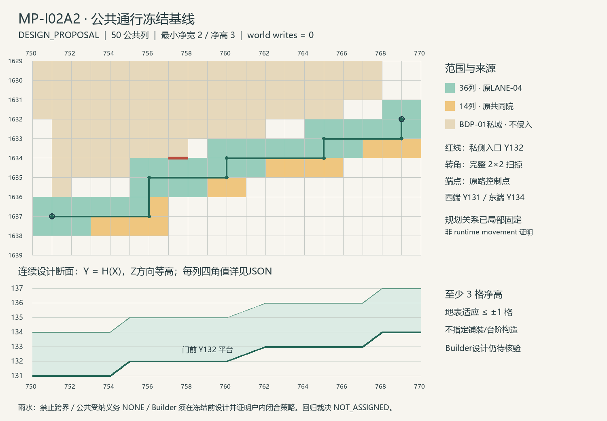

# MP-I02A2｜Freeze Baseline Closure

**BDP-01 r3：Planner handoff = DESIGN_FREEZE_READY。**

U-PUBLIC 与 U-RAINWATER 的 planning-interface HOLD 已在本任务 `DESIGN_PROPOSAL` 权威下闭合。该状态只表示 Planner 给出的关系足够局部解析，允许 Builder 尝试 Design Freeze；**建筑未达到 DESIGN_READY**。MP-I01R 当前设计保持 `STALE_FOR_FIDELITY_REVIEW`。

回归裁决：`NOT_ASSIGNED`。本包提交 GPT + Owner 审核，未判定 PASS / FAIL。`world writes = 0`。

## 直接审核入口

- [revision delta](revision-delta.md)
- [BDP-01 r3](BDP-01.json)
- [interface baselines r3](interface-baselines.json)
- [external service interfaces r3](external-service-interfaces.json)
- [closure register](closure-register.json)
- [revision lineage](revision-lineage.json)
- [provenance](provenance.json) / [validation](validation.json) / [manifest](manifest.json)
- [公共通行冻结基线](evidence/公共通行冻结基线.json) / [局部地表事实](evidence/局部地表事实.json)

## 公共通行闭合

从原 LANE-04 控制点 `(751,1637)` 到 `(769,1632)`，在 BDP-01 前沿固定一条任务内通行中心路径。路径与半宽 1 格的方形做连续扫掠，形成 **50 个完整公共列**：36 列来自原 LANE-04 mask，14 列来自已有 COMMON-EDGE。没有扩大公共土地集合，也没有进入 BDP-01 parcel；14 列是共同院内对通行的局部保护加强，不是新增家庭用地。

每个折点均有完整 2×2 转角空间。方形包含半径 1 的圆，因此连续路径每一点及其转角都有至少 2 格的水平净空；这不是只检查相邻 cells 连通。两端保留完整方形端部并对应原路控制点。本户 1 格私侧入口在 `(757,1633)` 的南面直接接入通道，公共横向净宽仍为 2 格。

设计行走面为 `Y=H(X)`：西端 Y131，门前平台 Y132，东端 Y134，分段线性连续。每列明确给出四角、中心设计标高与受保护的垂直范围；所有角点相对已有地表顶面调整不超过 ±1 格。保留每个单元最高设计表面以上至少 3 格净空。输入中的 ground block Y 与行走面 Y 已分开记录。

原名义斜向路中心线继续作为继承关系保留；r3 的局部扫掠路径替代本户范围内不能证明净宽的旧搜索/参考路径。原包其余路线不重新规划。通道范围、接触点和端部标高固定，户内门、落脚与高差仍由 Builder 设计。任何需要改变这些公共控制的方案必须返回接口修订。

这里的连续面是**规划设计表面**，不是已铺设的 Minecraft ramp 或已验证的台阶。公共详细实现需满足该基线；没有指定铺装、挡墙或精确楼梯构造，没有宣称 runtime movement 已验证。

PUBLIC-COORDINATOR 是本轮 task-local planning coordination role，负责此公共 baseline 和局部接口反馈。真实机构任命、土地及地役批准不再作为 planning freeze 前置条件；真实权限继续在 `BEFORE_WORLD_WRITE` 解决。

## 雨水责任闭合

| 字段 | r3 固定值 |
|---|---|
| cross_boundary_discharge | FORBIDDEN_UNLESS_FUTURE_INTERFACE_REVISION |
| public_receiving_obligation | NONE |
| builder_responsibility | DESIGN_AND_PROVE_PARCEL_LOCAL_CLOSED_STRATEGY |
| resolve_before | BEFORE_DESIGN_FREEZE |

当前没有公共 outfall 依赖，也没有公共受纳、清空或溢流承诺。Builder 必须在本 parcel 内设计并证明收集、调蓄、恢复及安全失效；本轮不提供降雨量、容积、渗透率或 gutter / pipe / cistern 构造。若不能成立，由 Builder 带有界适应证据返回新的 `UPSTREAM_PLANNING_ISSUE`，不能自行越界排放。

原 U-RAINWATER 的**上游责任不清**已经闭合；雨水性能证明作为 `B-RAINWATER-PERFORMANCE` 保留于冻结前，并未被删除或延后。

## Builder 仍需完成

- U-GROUND、U-HABITABILITY、B-TRANSLATION：保持原状态和责任。
- B-RAINWATER-PERFORMANCE：户内闭合策略及安全失效的设计证明。
- B-PLANNING-FIDELITY：消费 r3 后自行核验 Planning Fidelity Gate。
- U-TITLE、U-SUPPLY、U-OPERATION：保持原 resolve_before。

## 复现与归档

在本目录运行 `python -X utf8 冻结基线编译.py`，只消费 `inputs/` 中的明确快照及 `evidence/局部地表事实.json`。无需读取 BDP-02、Independent Review、MP-P04 或其它 Builder 答案。然后运行 `python -X utf8 交付校验.py`；在原本机可加 `--verify-sources` 核对已登记源文件 SHA256。可视化复现使用 `python -X utf8 公共通道制图.py`（Pillow）。

原归档、Canon、Planner/Builder Skill、shared contract、Minecraft 存档均未修改。当前 Planner v0.5 / shared contract v1.0 的源 HEAD 已核对，见 provenance。按 Owner 指定归档路径 `minecraft/MP-I02A2-FREEZE-BASELINE/` 提交；完成后停止，交 GPT + Owner 审核。
