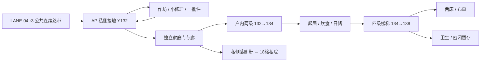

# MP-I02B — BDP-01 r3 冻结候选 r2

状态：**UNFROZEN_DESIGN_WITH_BLOCKERS**。本次是对 MP-I01R concept r1 的有界深化与复核，不是新建筑。`world writes = 0`。本文件是当前候选设计；`inputs/concept-r1/` 仅为不可变比较基线，其旧状态和接口解释不支配 r3。

## Architectural Intent — confirmed

保留西来货物转为轻载之前的低肩手提小件修理、短时收交与值守功能，同时容纳一户独立生活。作坊不是重锻造厂，家庭不穿作业危险面才能回家。石基、低单坡作坊、高双坡住屋、家庭廊和低肩私院继续由地形与混用程序产生，不改成统一台地或新地标。

继承 CIV-001 当前批准的成熟前现代石木技术和三域互补背景；西来运输方位不等于西域风格。EARLY_GROWTH 的先修理、后稳定家庭空间仍为条件性演化解释，不伪造实存历史。

本轮明确 **design occupancy = 2 名住户 / 1 户**，修理操作者包含在这两名住户中；允许 1 名临时交件者停在私侧 apron。这个数是 Builder 尺度场景，不是人口调查、户籍事实，也不是新增容量。实际人口不同必须重检。两人场景下所有功能均有固定位置，不靠临时撤床、移炉、占院或把家庭改成仓房来腾地。

## Final candidate Plan / Program / Space Graph

X/Z 均为含端点方块索引，Y 为行走面。

| 空间 | 范围 / Y | 功能与保留关系 |
|---|---|---|
| AP | 原 24 cells；接触 (757,1633) /132 | 有限收交；接 r3 公共 shared face Z1634、X757..758，未做公共台阶 |
| W | X755..756/Z1627..1630 /132 | 8 格净室，3 格工作/批件家具，单人冷作 |
| C | X758/Z1627..1630 /132 | 独立家庭廊；与作坊之间保持实体隔断 |
| L | X761..766/Z1625..1628 /134 | 起居、炊食、食储、水容器；四格楼梯；其余平面不挪给生产 |
| B | X761..763/Z1627..1628 /138 | 两个原生 1×2 床，X762 侧向通路；布草柜独立保留 |
| H | X765..766/Z1627..1628 /138 | 后排密闭便桶/洗盆，前排操作带；前屏与可关闭门 |
| Y | X751..753/Z1627..1632 /131 | 18 格、3×6 连通露天私院；不转作蓄水池 |

门位置不变：工作门 (755,132,1631)，家庭门 (758,132,1631)。卫生门 (766,138,1627) 采用右铰；试算左铰曾挡住横向操作带，改右铰后该路线障碍为零。开门是明示交互；不把穿过关闭门当作通行证据。

共存场景：一人修理、一人在起居/炊食位置时，彼此不共用房间或家具；家庭成员可由 C 到 Y，来客只停 AP；夜间两床同时保留，卫生和储藏仍不需要移床。洁净收水与污物搬运沿合法家庭入口错时进行，运营承诺仍归 U-OPERATION。**这些证明功能位置和路线共存，不证明炊火/排烟安全已经成立**；U-HABITABILITY 因烟道及防火关系未闭合而保持 blocker。

## Final candidate Section / structure / tectonics

保留院131、作坊132、住屋134/138 的分段剖面；两级石梯在 X759、760/Z1628，四级木梯在 X762..765/Z1625。主屋地板方块 Y133、二层楼板 Y137，主屋外包络 X760..767/Z1624..1629；作坊 X754..759/Z1626..1631。不设地下室或深槽，不扩大地块。

承重逻辑仍为各自石基/一格石墙→木楼板/上层角柱→X760、764、767 的横向屋架拉梁→双坡屋面。石作坊短跨单坡依靠自身墙和高侧收头；主屋与作坊连接的双层墙厚开口上方需按短跨过梁承担，不能把剖切图中的悬空局部当作独立无支承构件。本轮材料仅落实视觉和构造角色，不冒称云杉、深板岩或方解石已获供应。

实际 129 个最低铺地/基座接触单元包含私院和 apron，并非 129 个等荷载基础。80 个编辑单元位于现状最高地表方块，低于 ground_y 的编辑为 0。以接触单元下三格、2:1 横向扩散做证据覆盖筛查：778 格全部有允许的浅层事实；其中 7 格 air 位于相邻较低地表上方，不是地下空洞。该筛查不定义真实应力影响截止面，不能冒充岩体承载/节理或深部结构清空证明。详见 `地基影响核验.json`。

## Sequence — confirmed

西来先见低作坊和门内收交，再见高住屋；公共路继续向东，不进家庭才可通过。住户在固定私侧接触点进入，窄廊与两级上升后进入较宽起居区，再沿北侧四级梯上寝居。回院从家庭廊退到私侧落脚，下降一级进入3格宽露天院。工作、家庭两门的差别继续由用途及路线表达，不新增公共门楼。

## Minecraft Translation — partially resolved

564 条逐坐标 native state 在 `设计体素.json`，包含完整门上下半、床头脚、楼梯朝向/上下半/shape/waterlogged、半砖 type、梁轴向、可开窗与薄护栏。`设计几何.json` 为静态审阅盒，不是游戏读回。

| 构件 | 当前明确 translation | 冻结边界 |
|---|---|---|
| 两入口与卫生门 | spruce_door，north，完整上下半；卫生 right，其余 left | 关闭保私密、打开通行；未实测邻接更新 |
| 室内/分层楼梯 | spruce_stairs / stone_brick_stairs，east/bottom/straight/dry | 保留双半格踏面；806 个静态包络采样，非运行时步行 |
| 洞口护栏 | spruce_trapdoor，south/open，北边3/16厚 | 替代自定义0.12厚盒；剩余13/16通路，禁止把护栏随意折下作为通路 |
| 隐私屏 | 原两列改为两格高 spruce_planks；卫生前界薄屏 | 仍有两格后排器具与前排操作带 |
| 生活器具 | red_bed 两半；barrel；cauldron；furnace | 便桶/水桶是用途代理，无自动污水处理；furnace 不等于排烟闭合 |
| 窗 | 两处可开合 spruce_trapdoor + 其余小玻璃窗 | 起居与卫生局部开口；不是气流或排烟计算 |
| 屋面 | deepslate_tile_stairs / slabs，完整方向/半格状态 | 大轮廓保留；泛水、连续收水沟及安全回收未闭合 |
| 烟道 | (767,134..144,1626) 实体石占位 | **不是烟道净腔，不得点火使用或冻结** |

烟道局部适应审查：原1×1实体不能同时变成带完整一格净腔与一格厚外壳的原生构造。沿原中心扩到3×3将占用 X768 非本户列；向西移到中心(766,1626)的3×3竖井会占用上层楼梯落脚/卫生入口以及首层器具。北移中心(764,1624)则覆盖既有楼梯。三个局部方案均不直接采用，不能用一列石、若干无净腔 wall 或关闭炉方块宣称已经有排烟。更细的原生构造重排仍属 Builder 工作，**没有据此宣称所有本户方案不可能**。本轮返回实际未闭合状态，不以未知 Mod 或装饰烟粒子补证。

## Parcel-local rainwater — new issue

撤销旧设计“将来接公共受纳”的期待，r3 不提供公共受纳义务。原2个容器只保留干式占位。已比较原位置、北侧四合法列的地上封闭蓄水空间、地下/占院方案。北侧试算即使给出偏乐观的8m³有效容积，151m²全地块在50mm条件雨量下也产生7.55m³；再次降雨或初始非空就可能超量。数值是敏感性场景，不是 Site 降雨事实。

现在没有可证的恢复容量下限、合理累计设计事件及安全失效边界；岩石渗透、公共清运、跨界溢流和魔法消水均不得假设。有限储量不能单独证明闭合。返回 `MP-I02B-UPI-RAIN-01 / UPSTREAM_PLANNING_ISSUE`，详见 `雨水性能.json`。该问题不重开 U-PUBLIC，也不把 PUBLIC-COORDINATOR 实际任命作为冻结前提。

## 当前停止点

Plan / Section / Program / Massing 的主体仍有效；门、屏、护栏和窗采用本轮 r2 细化。规划忠实度已针对 r3 重检；已知程序、边界和阈限保持，但冻结 Gate 因雨水性能返回上游问题，且 Builder 内部地基和烟道相关条件仍未闭合。没有 `DESIGN_READY`、施工、Finishing 或套件结论。
