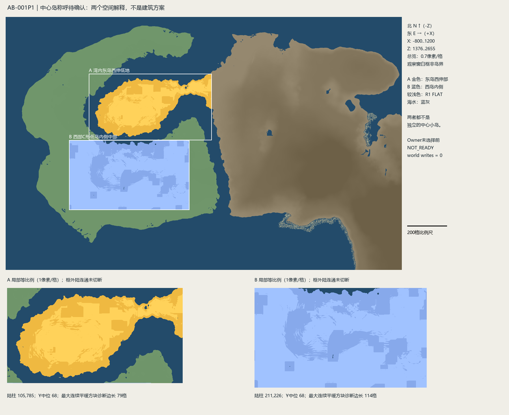

# AB-001P1｜中心岛 Site Gate

**Verdict：OWNER_SELECTION_REQUIRED。** 两个候选的设计进入状态均为 **NOT_READY**，原因是 Owner 指称未确认，而不是通过打分淘汰某个场地。当前没有唯一 Site，也没有建筑坐标。

当前main已经接受D-014的文明Canon与AB-001 Grammar，本轮不重新争论这些设定，也不修改它们。这里只消歧“西部平岛的中心岛”。

## 指称为何不能直接落点

C形低岛怀抱内最显眼的陆体是**A：东岛西伸低地**。它的形态有“湾中岛”的视觉效果，但真实四邻接干陆拓扑属于东岛LAND-00002，向东连续连接。A观察窗东侧有176个连续陆地边接出，北侧还有14个；例如(240,1752)与(241,1752)都属于东岛。这是窗口裁切，不是水道。

**B：西部C形低岛内侧中部**则满足“西部平岛”的字面归属，属于LAND-00001。但B也只是大岛本体的一段连续低地，不存在独立小岛边界。它只有在Owner想表达“西岛中央区域”时才成立，语义可信度低于A。

附近独立干陆小组件在`site-candidates.json`逐项列出，只有1～10柱量级；不能把这种露出水面的细碎陆格凑成第三个议会岛候选。本轮因此提供两个最有解释力的**地貌/局部区域读法**，不虚构三个独立岛。也不把某个crossing端点、旧SIRZ或局部高分地块直接当答案。

图中白框是人为比较窗口，着色只覆盖实际对应父陆体的陆柱，保留水洞。A金色、B蓝色；浅色为R1 FLAT。图不是政治边界或建筑总图。图中矩形切边、规则色斑不代表规划地块。实际地形尺度及坐标以JSON和RLE为准。

## 两个局部 Site Context

|内容|A 湾内西伸低地|B 西岛内侧中部|
|---|---|---|
|比较窗口X/Z|X=-380..240，Z=1664..2000|X=-480..128，Z=2000..2352|
|实际陆柱bounds|[-349,1664,240,1982]|[-480,2000,128,2352]|
|父陆体|东岛 component 2|西岛 component 1|
|实际陆柱面积|105,785|211,226|
|高程 min / median / max|58 / 68 / 75|33 / 68 / 79|
|slope8中位数 / P90|0.0884 / 0.1976|0.0625 / 0.1398|
|relief32中位数 / P90|4 / 8|2 / 8|
|FLAT / GENTLE柱|52,819 / 30,795|146,556 / 41,415|
|最大相连FLAT patch|51,129柱|145,286柱|
|全为FLAT的最大轴对齐正方形边长|79格|114格|

这些是候选比较窗内的事实，不是整座岛统计，也不是可施工面积。最大相连patch会触碰比较窗口，不能称自然闭合场地。79/114格正方形仅检查地形类别，不排除植被、熔岩、洞口、人工内容、地下结构或整体高差；它不是议事大厅平面、整地范围或推荐朝向。

**尺度解读：** 两区均存在远大于零碎岸礁的连续低平空间，足以继续讨论单座公共建筑及后续有限附属空间的场地条件。当前尚无具体大厅面积和功能尺寸，不据面积判断建筑一定能放下，更不要求把整个候选区域或岛变成政治中心。

### 岸线、水面与进入

A的西、北、南侧面对C形湾水面，东侧接出东岛。方向岸接触数N/E/S/W为640/414/654/590，包含小型内水边，不能直接当海岸长度。邻水表面高差通常为0格，最大4格；相邻水柱深度1～10格。这个0是岸方块顶层Y与水方块Y相同，**不是玩家落差/净空的实测值**。沿岸法向向内8步、步高≤1的接触N/E/S/W为579/343/528/504，只是LANDING_ACCESS_PROXY。

B在观察窗北侧面向A与内湾，其余方向大多接回西岛本体；所有方向都存在跨窗口干陆连接。邻水高差最高13格，局部坑口/陡岸应避免被中位数遮蔽。北向低步岸接触181处，其余方向接触多数属于小内水或岸线曲折，不能宣称四面环水。

A与西岛主体之间仍隔水；B可以由西岛内部自然陆地接近。WB-003R的X-00西岸(-164,2006)落在B，东岸(-170,1981)落在A，最短岸方格边距24.5153格。X-01的东岸也在A；X-02已拒绝，不能当有效跨越。这里复用跨岛几何关系，不规划桥、渡口、码头或道路。A向东的陆连通不等于实体可走；B岛内接近也未完成角色通行与危险检查。

### 视线与天际线

候选内各取一个“几何质心最近实柱+2格眼高”的**测量探针**，并非大厅坐标。A探针(-92,1817,eyeY74)，B探针(-176,2179,eyeY77)。沿8方位每4格查询缓存地形/水面，最远1200格或观察上下文边界。

A向东最大地形仰角约9.35°，对应(412,1817,Y157)；东南约6.76°。西、北、南主要对应湾水与C形低岸。由西岛/水面接近A时，东向高地可能形成后景，局部地表起伏与树冠可能遮挡建筑低部。由东侧陆颈进入则先沿陆体接近，视野关系不同。

B向东最大地形仰角约10.71°，对应(760,2179,Y254)。从内湾北侧接近B时会先面对北岸和向内抬升的低丘；从西岛内部进入则属于低地/林地中的渐近关系。两者都可能利用东部高地作地形后景，但8条地形射线不是完整可视域；未验证远处山顶是否露出前景、树冠遮挡、渲染距离、天气或实际游戏镜头。没有据此确定屋脊高度、朝向或建筑轮廓。

### 既有表面与保护项

A有6,624个R1植被样柱，树叶/树干出现比例约8.23% / 0.79%；B有13,356样柱，约12.52% / 0.99%。这说明当前树木结构不能忽略，但不是逐树清单。清树未授权。

B记录3,566个`dirt_path`表层柱，同时触发R1人工材料旗标；必须保留并在任何未来实际施工体积内复核其来源、连通和保护要求。A该旗标为0，两区暴露表层未发现waystone名称，**均不等于无人工建筑、地下结构或遮挡物**。

A/B另记录57/299个lava表层柱，B有fire和pointed_dripstone等名称。代表坐标见`review/surface-witnesses.json`。极低高程、洞口与危险材料说明“平地多”不能当作安全施工场地保证。未执行清理、填坑、截流、搬迁或任何世界写入。

## Design-readiness Gate

|问题|当前回答|
|---|---|
|是否足以开始大厅Plan / Section / Sequence？|**否**。Owner指称尚未确认；本轮只为选择提供局部Context。|
|最大约束|A连接东岛与“西域中心岛”称呼可能不一致；B不满足独立中心岛形态。两者均有地形、植被和危险表面限制。|
|Owner选择后可在设计中解决什么？|在选定区域内收敛单体范围，研究岸—陆到达关系、基座与局部高差、视线/树冠及克制的空间余量。本轮没有给方案。|
|world-write前必须再确认什么？|当时源freshness、准确施工体积、既有path/structure/waystone、地下与遮挡人工内容、熔岩/洞口、净空与真实通行、备份/授权。|

## 证据与停止

R1及WB-003R当前源region哈希一致，缓存hash已核对。本轮只查询缓存；新世界方块读取0、broad rescan 0、world writes 0。完整源清单在本地，轻量包保存哈希、比较结果、关键见证与复现代码。前序evidence、World Canon和Architecture Grammar保持不可变。

请Owner确认图中的A、B是否对应所称中心岛；若均不是，指出目标相对于图中两者的位置即可。候选坐标是核验出来的观察范围，并非猜出的最终Site坐标。**到此停止，交GPT独立审核与Owner mapping confirmation。**
