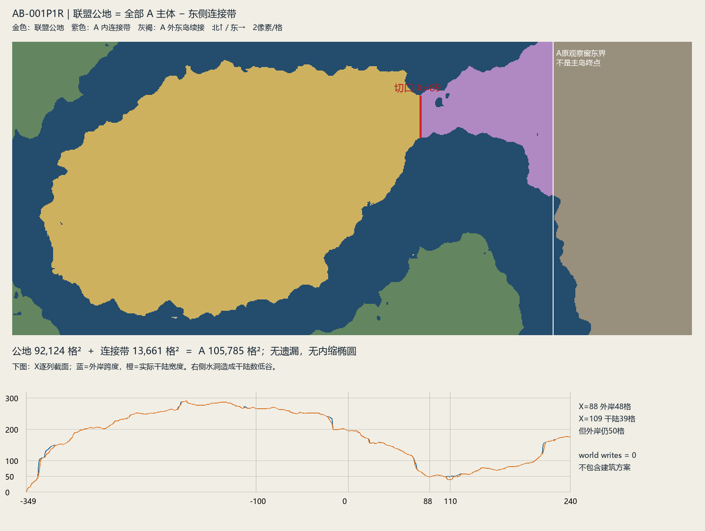

# 联盟公地东侧连接带边界拟合

状态：**PREFERRED BOUNDARY FIT / AWAITING INDEPENDENT REVIEW**。本轮只拟合D-018/D-019已经授权的政治土地分界，不重新决定土地规则。

## 首选切口与真实面积

首选切口位于 **X=88与X=89两列之间**。按方块占用[x,x+1)的坐标约定，边界平面是 **X=89**，实际陆地接口为 **Z∈[1726,1774]**、48条单位边。它只作为Commons与connector的政治接口，不表示物理挖断。

|分区|定义（均与原A真实geometry求交）|实际面积|方块bounds [xmin,zmin,xmax,zmax]|四邻接分量|
|---|---|---:|---|---:|
|Alliance Commons|X≤88的全部A陆地|92,124|[-349,1685,88,1982]|1|
|A内东侧connector|X≥89的全部A陆地|13,661|[89,1664,240,1841]|1|
|原Candidate A|原RLE，不改写|105,785|[-349,1664,240,1982]|1|

**92,124 + 13,661 = 105,785**。Commons∪connector=A，交集为空。没有因“椭圆不够规整”剔除任何西侧边缘，没有第二层小公地。内水洞沿用A原mask，不填水、也不扩张为水域权利裁定。图中A东界仍是前序观察窗边界，不是整个中域或主岛边界。

## 为什么选择这里

逐X列记录实际干陆数量、南北最外岸跨度、内水/非陆缺口、下一列陆地邻接边数，并以16列分带保存变化。完整数列见`review/cross-sections.json`。

|X列|干陆宽度|北岸Z|南岸Z|外岸跨度|
|---:|---:|---:|---:|---:|
|0|196|1696|1891|196|
|40|152|1696|1847|152|
|60|127|1698|1824|127|
|70|109|1697|1805|109|
|80|61|1722|1782|61|
|88|48|1726|1773|48|
|100|53|1718|1770|53|
|109|39|1720|1769|50|
|120|51|1712|1768|57|
|160|69|1699|1767|69|
|200|96|1685|1780|96|
|240|176|1664|1839|176|

A的西端尖部也有很窄的截面，但那里是陆体末端，不是向东主岛连接的neck，因此不把“全X绝对最窄”当目标。图像与岸线共同将相关东侧收束段定位在X70～130附近：北岸向南移、南岸向北收，X70的109格在X88收至48格；更东侧重新展宽并接向主岛。

首选保留X88这整列最窄外岸截面在Commons，把其东缘设为切口。切后Commons保留视觉中心主体的完整不规则海岸，connector保留向右主岛延伸的低地与北侧接出部分。没有按面积预算倒推该线，也没有拟合数学椭圆。

## 小水洞与像素级不确定性

X109/110只有39个干陆位置，但北岸1720、南岸1769之间跨度仍50格，少掉的11格是内部非陆位置。该低谷主要反映内部水洞，不是比X88更窄的外岸陆颈。若在平面X110切分，Commons为93,174格²，比首选多1,050格²；它会将一段已经拉长的neck保留到Commons。作为下游诊断记录保留，**不列为同等首选政治边界**。

平面X88与X89均切断48条陆地邻接边；区别是是否保留最窄的X88列。这里采用保留完整最窄列的东缘约定。平面X88/89/90下Commons为92,076 / 92,124 / 92,173格²，两侧始终各一个分量。±1格影响48～49格²，是栅格级边界约定，不能包装成唯一自然界线。

因此本轮给出一个首选切口，同时公开像素级敏感性与下游水洞诊断，没有隐藏第二处同样合理的外岸neck；最终是否接受此政治拟合由GPT独立审核。

## 连通与地形辅助

两分区各自四邻接连通。connector在A原窗口东侧与北侧共有190条父陆体接出边，其中东侧176条、北侧14条，继续属于R1 component2。独立核验还在**不进入Commons、只取X≥89的父陆体**上找到从connector东界到X400的干陆拓扑路径，见`review/parent-continuation.json`。这是连通性见证，不是道路、通达性或运输规划。

Commons高程min/median/max为58/69/75，connector为60/64/68；relief32中位/P90分别4/8与3/5。连接带整体更低，地形支持“主体向低陆颈续接”的读法，但没有强迫政治边界追随等高线。slope8忽略未知值后比较，Commons有8,729个未知坡度柱、connector有2,958个；未知不按0坡处理，完整数字见机器边界文件。

## 校验与交回

使用AB-001P1不可变A实际RLE和R1缓存；本轮新增world block reads=0，broad rescan=0，world writes=0。集合并交、全部陆柱覆盖、各自连通、父陆续接、RLE往返与精确轮廓边集合均核验。轮廓包含所有天然不规则边缘及内部孔洞，没有平滑为椭圆。源hash、前后inventory与重建校验见validation。

输出是Research中的授权边界拟合，不修改World Canon、Grammar或Capacity文件。**AB-001P2继续HOLD**，待GPT接受92,124格²这一首选边界结果后再重算Program/Capacity。本轮没有设计三席议事大厅或任何附属空间。
